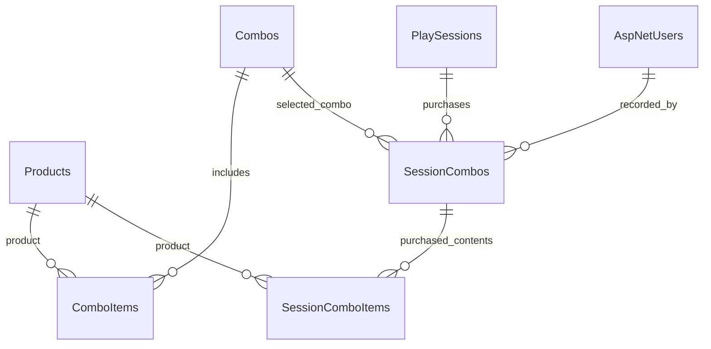

# Combo gồm giờ chơi và đồ ăn nước uống

Cập nhật 01/10/2026. Người dùng xác nhận combo có cả giờ chơi và đồ ăn/nước uống. Phần này bổ sung quan hệ cho bảng Combos trong schema mở rộng, không tạo lại database hoặc seed lại dữ liệu.

## Quan hệ

| Bảng | Ý nghĩa | Dữ liệu chính |
|---|---|---|
| Combos — đã có | Danh mục gói đang bán | Name, Price, PlaytimeHours, IsActive |
| ComboItems — mới | Một gói có món gì và bao nhiêu | ComboId + ProductId là PK ghép, Quantity > 0 |
| SessionCombos — mới | Phiên chơi đã mua gói nào | SessionId, ComboId, Quantity > 0; tên/giá/giờ chụp lúc mua; người ghi nhận và thời điểm |
| SessionComboItems — mới | Thành phần món đã cam kết lúc mua | SessionComboId + ProductId là PK ghép, ProductNameSnapshot, QuantityPerCombo > 0 |

Ví dụ minh họa, không phải giá đã chốt hay dữ liệu đã thêm: gói “2 giờ + 2 nước + 1 khoai”, giá 200.000đ. ComboItems có hai dòng: sản phẩm nước số lượng 2, sản phẩm khoai số lượng 1. Nếu phiên mua 2 gói, SessionCombos.Quantity=2, UnitPriceSnapshot=200000, PlaytimeHoursSnapshot=2. Snapshot món vẫn là 2 nước và 1 khoai cho mỗi gói: tổng quyền lợi là 4 nước, 2 khoai, 4 giờ; giá gói là 400.000đ trước các quy tắc giảm giá khác.

## Bảo toàn lịch sử

Khi mua, backend phải sao chép tên, giá, giờ từ Combos sang SessionCombos và sao chép toàn bộ thành phần sang SessionComboItems trong cùng transaction. Mọi giá trị snapshot lấy từ database do server đọc, không tin giá gửi từ trình duyệt. Thay giá/tên/số món của combo hiện tại không cập nhật các snapshot đã mua.

Không cascade delete các liên kết này. Sản phẩm hoặc combo đã được sử dụng nên ngừng bán bằng IsActive; FK ngăn xóa danh mục có lịch sử. Với danh mục chưa từng bán, cần gỡ các dòng ComboItems trước khi xóa combo. Snapshot không tự bất biến trước SQL UPDATE có quyền; tính bất biến còn cần được bảo vệ trong service/phân quyền ứng dụng.

Schema cho phép một phiên có nhiều lượt mua combo và một lượt mua nhiều gói. Đây là lựa chọn kỹ thuật để không khóa cứng một combo/phiên, chưa phải xác nhận mọi quy tắc mua bổ sung, hủy hoặc hoàn tiền. Không tự thêm UI bán combo trong tác vụ này.

## Phần nghiệp vụ phải làm tiếp trước khi bán combo

- TV4 làm danh mục ComboItems và luồng mua/giao món; kiểm tra combo đang bán, có ít nhất một món, món còn bán và đủ tồn kho. FK chỉ xác minh ID tồn tại, không kiểm tra role/active/stock.
- Người ghi nhận lấy từ phiên đăng nhập; chỉ Staff/Admin được mua thay khách theo quyền ứng dụng. Kiểm tra PlaySession đang Active. Khóa dữ liệu cần thiết trong transaction để tránh mua vượt tồn hoặc đọc thành phần đang sửa dở; xử lý gửi yêu cầu lặp để không tạo hai lượt mua/trừ kho hai lần.
- Mỗi món trong combo trừ tồn theo QuantityPerCombo × số gói. Cần chốt thời điểm giữ/trừ tồn và cách xử lý hủy; không đồng thời trừ một lần ở mua combo và thêm lần nữa khi giao món.
- OrderDetails hiện chỉ mô tả món lẻ. SessionComboItems là quyền lợi món đã mua, chưa phải trạng thái món đã phục vụ. Trước khi dùng Orders để giao món combo, bổ sung liên kết nguồn và validation phù hợp; không chèn món combo như món lẻ có đơn giá thông thường rồi tính tiền lần nữa.
- TV1 phối hợp TV3/TV4 thiết kế tiền vượt giờ. Procedure usp_CloseSession hiện tính toàn bộ giờ chơi theo đơn giá giờ, chưa trừ giờ trong combo. Vì vậy chưa được cộng giá combo vào tổng cũ rồi gọi đó là hóa đơn đúng.
- Invoices hiện có TotalPlaytime, TotalFandB và DiscountAmount; chưa có thành phần tiền combo riêng. Chốt cách thể hiện giá gói, phần vượt giờ, món gọi thêm và giảm giá trước khi cập nhật công thức hóa đơn. Hạn chế giảm giá hai lần và ghi nhận điểm hai lần.
- Chưa chốt giới hạn loại bàn, giờ áp dụng, cộng dồn combo, giờ không dùng hết, hủy/hoàn combo và nâng hạng. Các chính sách này không được script mới tự quyết định.

## Cài đặt và xem sơ đồ

- **Đã áp dụng thành công ngày 01/10/2026 trên localhost / BilliardDB. Không chạy lại 05 hoặc Full trên database này.** Ba bảng mới hiện trống; dữ liệu nghiệp vụ cũ được giữ nguyên.
- Database đang làm trong ảnh: **localhost / BilliardDB**. Instance localhost\SQLEXPRESS có database cùng tên nhưng là bản 13 bảng cũ; không áp dụng nhầm ở đó.
- Database mở rộng 21 bảng đã có dữ liệu: chỉ chạy `BMS_Database_Starter/05_AddComboRelations.sql` một lần. Script mới tạo ba bảng trống trong transaction, từ chối khi đã tồn tại; không xóa/sửa dữ liệu cũ.
- Máy mới chưa có database: dùng bản `BilliardDB_Full.sql` đã bổ sung cùng ba bảng. Sau đó không chạy lại 05 vì các bảng đã có. Tổng schema mở rộng thành **24 bảng**.
- Trong SSMS: mở Database Diagram → chuột phải vùng trống → Add Table → thêm ComboItems, SessionCombos, SessionComboItems. Sơ đồ cũ không tự thêm hình các bảng mới. Nếu danh sách chưa cập nhật, đóng/mở lại sơ đồ và Refresh Tables.
- Đọc `Verify_BilliardDB.sql` để kiểm tra; số bảng kỳ vọng mới là 24. Các số lượng “ExpectedAfterSeed” chỉ đúng ngay sau seed, không phải ràng buộc khi đã có nghiệp vụ.
- SSMS đã tạo thêm `dbo.sysdiagrams` để lưu sơ đồ. Có 25 bảng nếu đếm cả bảng hỗ trợ này; truy vấn verify đã loại riêng nó để đếm 24 bảng nghiệp vụ.

## Kết quả kiểm tra thực tế

- Cả 7 khóa ngoại mới đều bật và được SQL Server xác nhận dữ liệu hợp lệ (`is_disabled=0`, `is_not_trusted=0`), không cascade delete.
- `BMS_Database_Starter/tests/ComboRelations_Rollback.sql` đã chạy thành công: tạo gói có nước và đồ ăn, mua 2 gói, sửa danh mục thử rồi xác nhận tên/giá/giờ/số món đã mua giữ nguyên. Kiểm tra từ chối ProductId không tồn tại, số lượng bằng 0 và xóa combo đang được tham chiếu.
- Toàn bộ dòng thử được rollback; số lượng Products, Combos và ba bảng mới trước/sau không đổi. IDENTITY có thể tăng dù rollback, nên ID có khoảng trống là bình thường. Không reset bộ đếm ID.
- Đây là kiểm tra cấu trúc và lưu snapshot bằng SQL, chưa phải kiểm thử luồng mua combo trong ứng dụng. Chưa thay code C#, procedure đóng phiên, tồn kho hoặc tính hóa đơn.

Ba bảng mới thuộc phần combo của TV4; TV1 phối hợp quan hệ PlaySessions và TV3 phối hợp hóa đơn/thanh toán. Tài liệu SDS phần Hùng trước đây mô tả snapshot 21 bảng, cần cập nhật số bảng tổng khi ghép báo cáo cuối.
