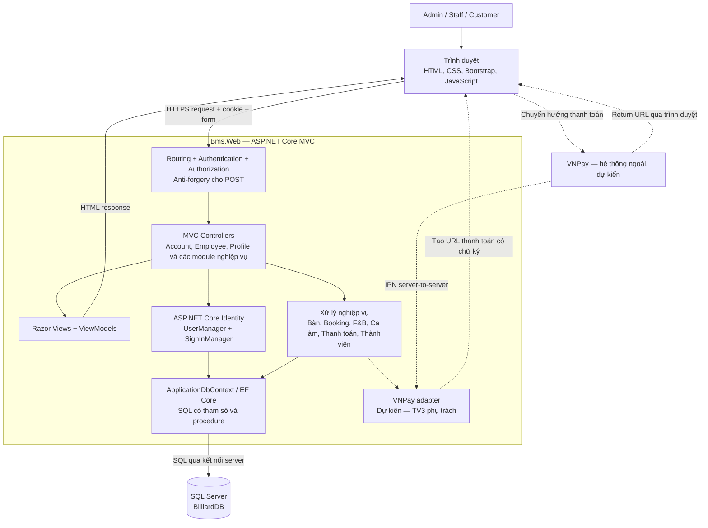
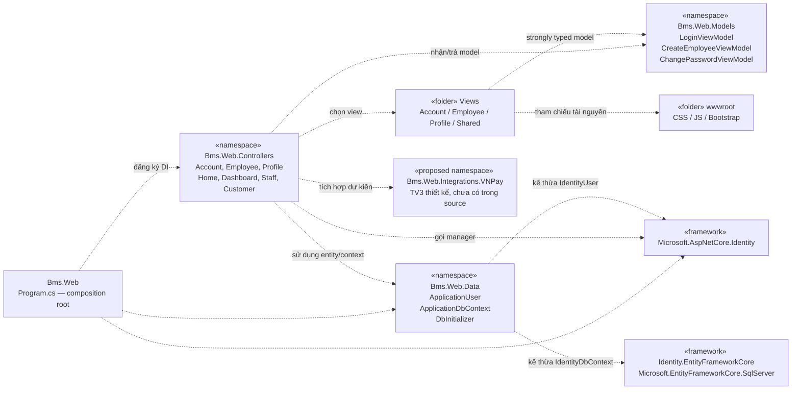
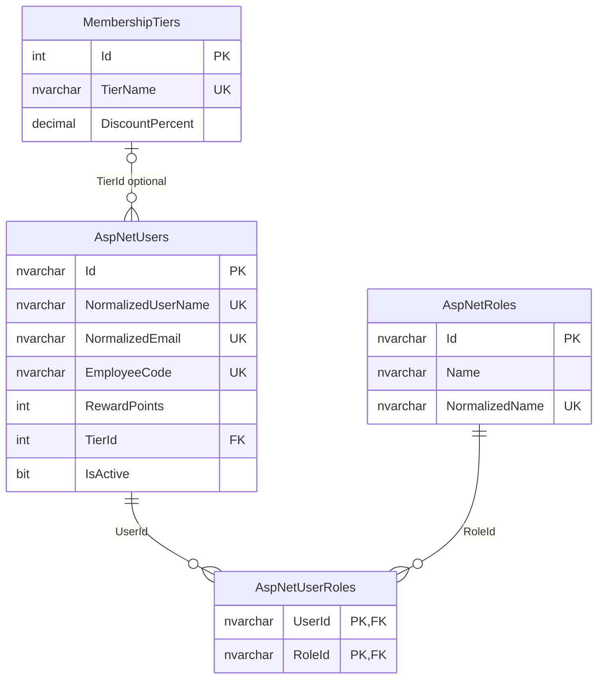
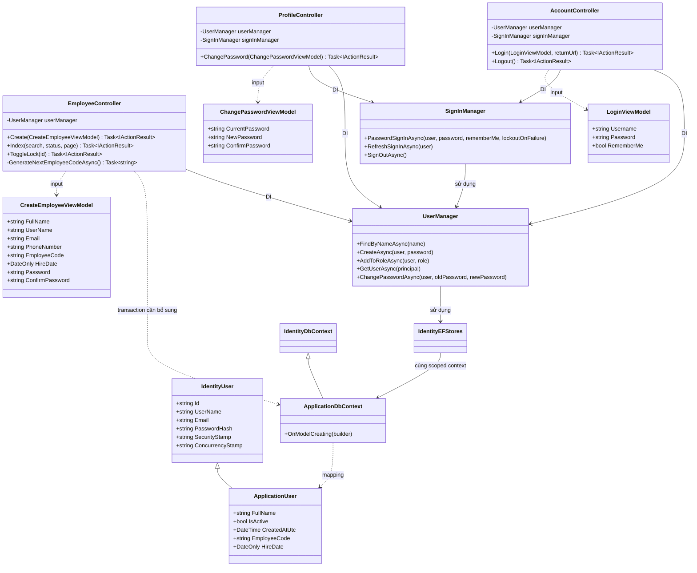
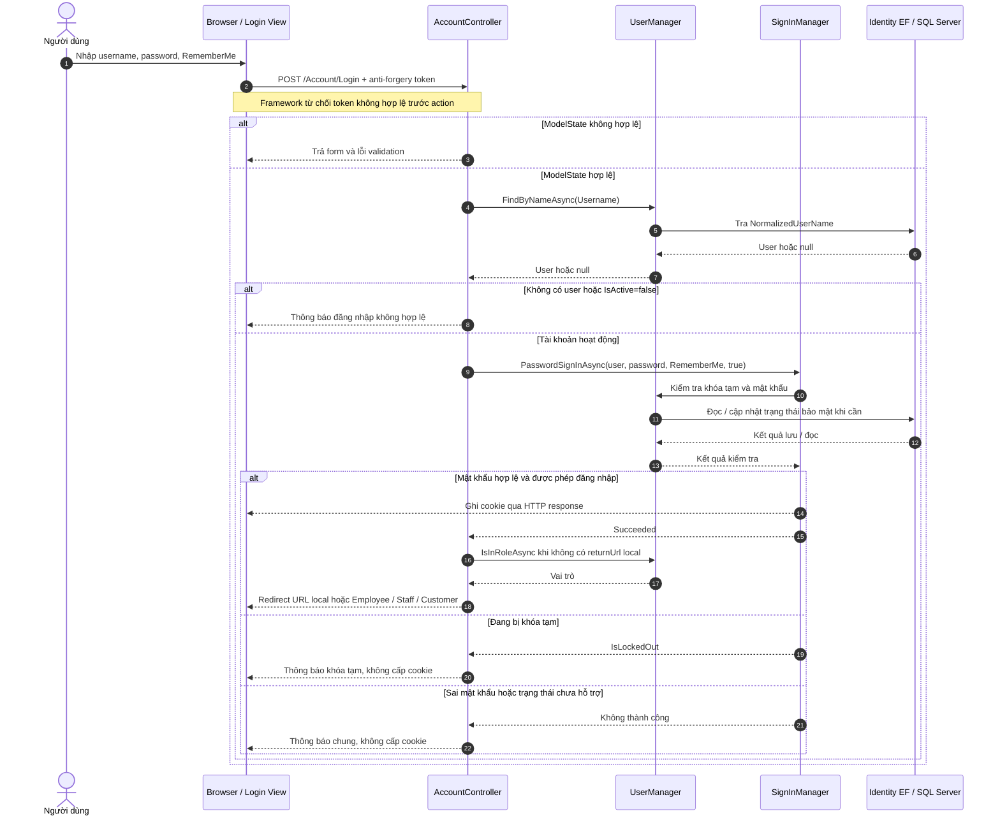
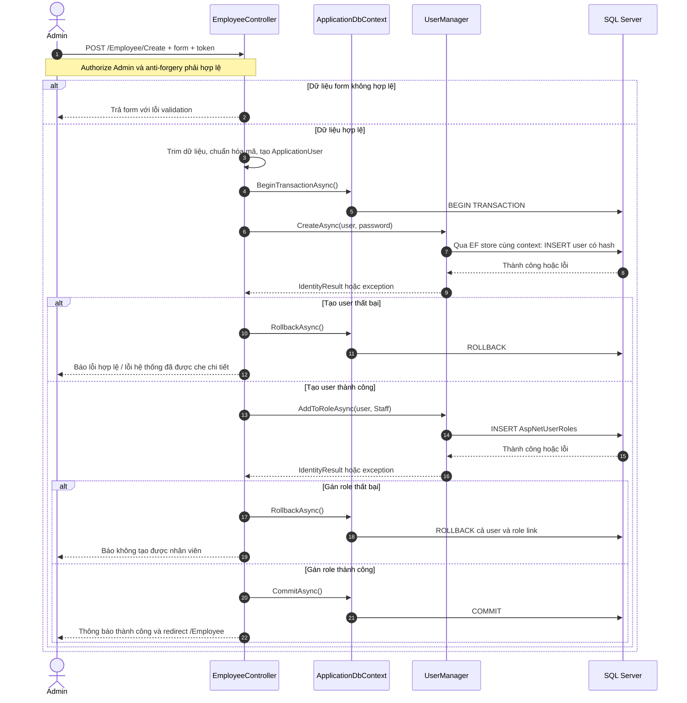
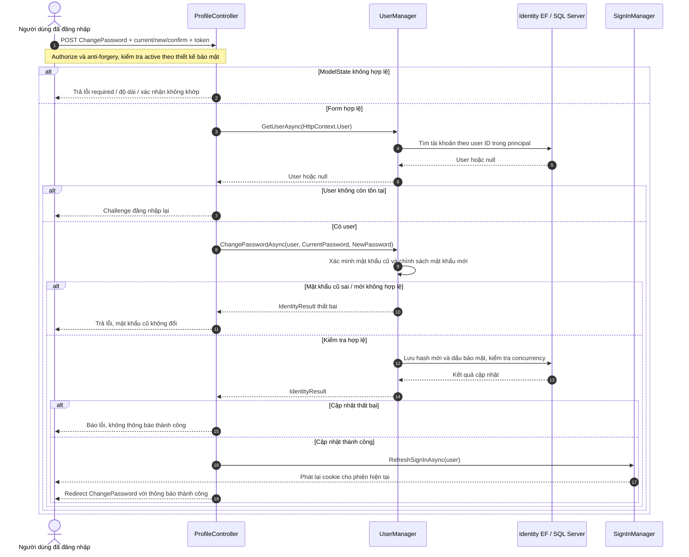

# Billiard Management System

## Software Design Specification — Phần của Hùng

**Ngày cập nhật:** 01/10/2026. **Phiên bản:** 1.0. **Người phụ trách theo phân công:** Hùng.

Tài liệu cung cấp phần thiết kế kiến trúc, package, bốn bảng dữ liệu và thiết kế chi tiết cho đăng nhập, tạo nhân viên, đổi mật khẩu. Cấu trúc đánh số tương ứng mẫu SDS của nhóm; có thể ghép các mục I, II và III vào báo cáo chung. Nội dung giải thích bằng tiếng Việt; tên lớp, bảng và phương thức giữ nguyên theo C# và SQL Server.

**Cách đọc trạng thái:** “Hiện có” nghĩa là đã thấy trong mã nguồn hoặc script, không đồng nghĩa đã kiểm thử chạy thực tế. “Thiết kế cần bổ sung” là hành vi phải triển khai để đáp ứng SDS. “Dự kiến” là thành phần thuộc phạm vi mở rộng mới được giao. Bản SDS không khẳng định các module VNPay, điểm thưởng và gọi món đã hoạt động.

Nguồn đối chiếu: `BMS_Database_Starter/BilliardDB_Full.sql`, `src/Bms.Web/Program.cs`, `Data/ApplicationUser.cs`, `Data/ApplicationDbContext.cs`, ba controller Account/Employee/Profile và các ViewModel tương ứng. Repo hiện nhắm **.NET 8**, dùng **ASP.NET Core MVC, Razor, Bootstrap, Identity và EF Core SQL Server 8.x**; tên database trong phần tạo schema là **BilliardDB**. Các thông tin cũ về chưa có project hoặc chỉ có 13 bảng không còn đại diện cho source hiện tại.

### Change Log

| Date | A / M / D | In charge | Change Description |
|---|---|---|---|
| 01/10/2026 | A | Hùng | Soạn phần kiến trúc, package, bốn bảng, thiết kế đăng nhập/tạo Staff/đổi mật khẩu và bảo mật; đối chiếu với source hiện tại |

# I. High Level Design

## 1. Software Architecture

### 1.1 Kiến trúc tổng thể

BMS sử dụng kiến trúc ứng dụng web MVC triển khai trong một ứng dụng ASP.NET Core. Trình duyệt hiển thị HTML do Razor tạo và gửi yêu cầu HTTP đến controller. Controller tiếp nhận ViewModel, kiểm tra dữ liệu và điều phối xử lý. ASP.NET Core Identity chịu trách nhiệm tài khoản, mật khẩu, vai trò và cookie đăng nhập. EF Core ánh xạ dữ liệu tài khoản vào SQL Server; các nghiệp vụ đặt bàn/phiên chơi dùng procedure có tham số theo thiết kế database.

Các tầng dưới đây là phân chia trách nhiệm logic; không có nghĩa mỗi tầng là một server hoặc microservice riêng. Các module thanh toán, F&B, ca làm và thành viên được đưa vào kiến trúc đích theo phân công mới, chưa coi là chức năng đã triển khai. Đối với nghiệp vụ phức tạp, nhóm có thể bổ sung service; source của Hùng hiện gọi Identity trực tiếp từ controller.

**Hình I.1 — Kiến trúc logic toàn hệ thống.** Nét đứt biểu thị tích hợp dự kiến. Luồng IPN và Return URL thuộc thiết kế thanh toán của TV3, cần thống nhất trước khi triển khai; không tự công nhận thanh toán chỉ từ thông tin trình duyệt gửi về.

### 1.2 Architecture component descriptions

| No | Component | Description |
|---|---|---|
| C01 | Client tier — Web browser | Hiển thị giao diện, nhập dữ liệu và gửi yêu cầu. Không kết nối trực tiếp database, không tự quyết định quyền hoặc kết quả giao dịch |
| A01 | Routing và security pipeline | Chọn action, xác thực cookie, kiểm tra quyền; kiểm tra anti-forgery ở các POST có thay đổi dữ liệu |
| A02 | Controllers | Điều phối yêu cầu và trả View/Redirect. Account xử lý đăng nhập; Employee quản lý Staff; Profile xử lý đổi mật khẩu của người đang đăng nhập |
| A03 | Razor Views và ViewModels | Views dựng HTML; ViewModels giới hạn dữ liệu đầu vào/đầu ra và khai báo validation. Không đưa PasswordHash ra giao diện |
| A04 | ASP.NET Core Identity | Quản lý user, role, kiểm tra và băm mật khẩu, khóa tạm và cookie. Tất cả vai trò dùng chung nguồn tài khoản |
| A05 | Các module nghiệp vụ | Bàn/phiên, booking/ca làm, F&B, thanh toán, điểm và hạng. Các nhóm cung cấp thiết kế chi tiết trong phần II của mình |
| A06 | Data access | ApplicationDbContext và Identity EF stores truy cập bảng tài khoản. Procedure có tham số xử lý nghiệp vụ cần kiểm soát transaction/đặt trùng |
| D01 | SQL Server | Lưu dữ liệu và thực thi PK, FK, UNIQUE, CHECK, transaction. Schema do SQL scripts quản lý theo SQL-first |
| E01 | VNPay adapter — dự kiến | Biên tích hợp bên ngoài, tách khỏi quản lý nhân viên. Xác thực thông báo thanh toán, xử lý lặp và cập nhật trạng thái do TV3 thiết kế |

### 1.3 Ranh giới trách nhiệm

Hùng phụ trách tài khoản và quyền dùng chung cho các module. Các controller nghiệp vụ nhận định danh người gọi từ `HttpContext.User`, không tin `StaffId`, `CustomerId` hay role do form tùy ý gửi. Membership tier chỉ biểu thị ưu đãi; vai trò Admin/Staff/Customer quyết định quyền. Nâng hạng khách hàng không cấp quyền quản trị.

Ứng dụng dùng cookie Identity cho website MVC. Kiến trúc này không có JWT Security Filter như ví dụ trong template. SQL scripts là nguồn quản lý schema; ứng dụng không gọi `EnsureCreated`, `Migrate` hoặc áp dụng migration khởi tạo lên BilliardDB đã có bảng.

## 2. Package Diagram

### 2.1 Sơ đồ package

Trong C#, package được biểu diễn bằng namespace/thư mục và các dependency framework. Sơ đồ sau thể hiện phụ thuộc, không phải thứ tự thực thi. `Views` và `wwwroot` là nhóm tài nguyên, không phải namespace C#.

**Hình I.2 — Package Diagram.** Mũi tên nét đứt biểu thị dependency; riêng namespace VNPay được gắn nhãn dự kiến. Không có dependency từ Data ngược về Controllers/Views.

### 2.2 Package descriptions và quy ước đặt tên

| Package / thư mục | Trách nhiệm | Quy ước và ví dụ |
|---|---|---|
| `Bms.Web.Controllers` | Tiếp nhận HTTP, kiểm tra quyền, điều phối xử lý | PascalCase và hậu tố `Controller`: `EmployeeController`; action `Login`, `Create`, `ChangePassword` |
| `Bms.Web.Models` | Dữ liệu form và hiển thị, validation | PascalCase và hậu tố `ViewModel`: `LoginViewModel`, `CreateEmployeeViewModel`; không bind trực tiếp toàn bộ entity từ form |
| `Bms.Web.Data` | Entity, mapping và khởi tạo dữ liệu Development | `ApplicationUser`, `ApplicationDbContext`, `DbInitializer`; không viết HTML tại đây |
| `Views/{Controller}` | Giao diện Razor theo action | `Views/Account/Login.cshtml`, `Views/Employee/Create.cshtml`, `Views/Profile/ChangePassword.cshtml` |
| `Views/Shared` | Layout và thành phần dùng chung | `_Layout.cshtml`; tên partial có tiền tố `_` |
| `wwwroot` | Tài nguyên trình duyệt | Tên CSS/JS rõ mục đích; không lưu connection string hoặc khóa VNPay |
| `Bms.Web.Integrations.VNPay` — dự kiến | Adapter giao tiếp VNPay | Namespace đề xuất cho TV3; tên lớp cần chốt khi triển khai |

Kiểu và public member dùng PascalCase; tham số/biến cục bộ dùng camelCase; dependency private dùng `_userManager`, `_signInManager`. Phương thức bất đồng bộ mới nên có hậu tố Async; action hiện hữu giữ nguyên tên route đang dùng. Tên bảng và cột giữ đúng PascalCase của SQL script. Các module bổ sung phải dùng cùng `ApplicationUser` và cùng cấu hình Identity.

## 3. Database Design — Bốn bảng của Hùng

### 3.0 Mô tả file và quan hệ

`BMS_Database_Starter/BilliardDB_Full.sql` khai báo 21 bảng, gồm bộ Identity và các bảng nghiệp vụ mở rộng; cũng chứa procedure, seed và phần truy vấn kiểm tra. Tài liệu dưới đây mô tả **DDL trong file**, chưa xác nhận 21 bảng đó đều đã được triển khai trên SQL Server local. Không chạy nguyên script này lên database đang có dữ liệu.

Các mục “Constraints” phản ánh đúng SQL hiện có. Những kiểm tra cần làm ở ứng dụng được ghi riêng; không biến yêu cầu nghiệp vụ thành một CHECK/NOT NULL chưa tồn tại trong database.

**Hình I.3 — ERD phần tài khoản và hạng thành viên.** ERD rút gọn cột để dễ đọc; bảng mô tả bên dưới là danh sách đầy đủ. Một user có 0 hoặc 1 tier; một tier có 0 đến nhiều user. User và Role có quan hệ nhiều–nhiều qua AspNetUserRoles. Ứng dụng hiện gán một role khi tạo tài khoản nhưng schema không giới hạn mỗi user chỉ một role.

### 3.1 AspNetUsers

**Mục đích:** nguồn tài khoản chung của Admin, Staff, Customer; lưu thông tin nhận diện, thông tin nhân viên, trạng thái bảo mật và liên kết hạng thành viên. **PK:** Id. **FK:** TierId → MembershipTiers.Id.

| Column | Constraints | Notes |
|---|---|---|
| `Id` | nvarchar(450), NOT NULL, PK | Khóa chuỗi Identity; không phải số tự tăng |
| `UserName` | nvarchar(256), NULL | Tên đăng nhập gốc; form tạo Staff bắt buộc nhập |
| `NormalizedUserName` | nvarchar(256), NULL; unique filtered index `UserNameIndex` khi khác NULL | Giá trị chuẩn hóa phục vụ tra cứu; Identity quản lý |
| `Email` | nvarchar(256), NULL | Email gốc; form tạo Staff bắt buộc và kiểm tra định dạng |
| `NormalizedEmail` | nvarchar(256), NULL; unique filtered index `EmailIndex` khi khác NULL | Không trùng email sau chuẩn hóa; cấu hình RequireUniqueEmail=true |
| `EmailConfirmed` | bit, NOT NULL, DEFAULT 0 | Cờ xác nhận email; hiện chưa bắt buộc xác nhận để đăng nhập |
| `PasswordHash` | nvarchar(max), NULL | Hash do Identity tạo; NULL không có nghĩa mật khẩu rỗng hợp lệ |
| `SecurityStamp` | nvarchar(max), NULL | Dấu thay đổi bảo mật để kiểm tra tính hợp lệ của phiên đăng nhập |
| `ConcurrencyStamp` | nvarchar(max), NULL | Token kiểm soát cập nhật đồng thời của Identity; không phải rowversion |
| `PhoneNumber` | nvarchar(20), NULL; CHECK khác chuỗi trắng nếu có; unique `UX_User_Phone` khi khác NULL | Cần chuẩn hóa thống nhất trước lưu; index chỉ chặn chuỗi trùng |
| `PhoneNumberConfirmed` | bit, NOT NULL, DEFAULT 0 | Cờ xác nhận số điện thoại |
| `TwoFactorEnabled` | bit, NOT NULL, DEFAULT 0 | Dự phòng 2FA; chưa có luồng giao diện 2FA đầy đủ trong phần này |
| `LockoutEnd` | datetimeoffset(7), NULL | Mốc hết khóa tạm khi đăng nhập sai |
| `LockoutEnabled` | bit, NOT NULL, DEFAULT 1 | Cho phép cơ chế khóa tạm áp dụng cho user |
| `AccessFailedCount` | int, NOT NULL, DEFAULT 0; CHECK >= 0 | Bộ đếm thất bại do Identity quản lý |
| `FullName` | nvarchar(100), NOT NULL; CHECK LEN(LTRIM(RTRIM(FullName))) > 0 | Họ tên hiển thị, không chấp nhận chỉ khoảng trắng |
| `IsActive` | bit, NOT NULL, DEFAULT 1 | Khóa quản trị; false phải chặn đăng nhập và truy cập được bảo vệ |
| `CreatedAtUtc` | datetime2(0), NOT NULL, DEFAULT SYSUTCDATETIME() | Thời điểm tạo theo UTC |
| `EmployeeCode` | nvarchar(20), NULL; CHECK không trắng nếu có; unique `UX_User_EmployeeCode` khi khác NULL | Mã nhân viên; tính duy nhất áp dụng toàn bảng, không chỉ role Staff |
| `RewardPoints` | int, NOT NULL, DEFAULT 0 | Script chưa có CHECK >= 0; quy tắc cộng/trừ điểm thuộc TV3/TV4 |
| `TierId` | int, NULL, FK → MembershipTiers.Id | NULL nghĩa chưa gán hạng; FK không có ON DELETE CASCADE |
| `HireDate` | date, NULL | Ngày vào làm, không chuyển UTC |

**Liên kết ngoài phần Hùng:** bảng này được các bảng Identity phụ thuộc và các bảng Bookings, PlaySessions, Invoices, WorkShifts tham chiếu. Các FK nghiệp vụ không khai báo cascade delete trong script. Do đó quản lý nhân viên ưu tiên vô hiệu hóa, không xóa tài khoản có lịch sử.

**Mapping cần bổ sung:** `ApplicationUser.cs` hiện có các trường nhân viên nhưng chưa có RewardPoints/TierId/navigation MembershipTier. Cần mapping rõ nếu module thành viên đọc/ghi qua EF; không tự coi chúng đã có chỉ vì SQL đã khai báo.

### 3.2 AspNetRoles

**Mục đích:** lưu nhóm quyền Admin, Staff, Customer. Hạng thành viên không lưu tại đây.

| Column | Constraints | Notes |
|---|---|---|
| `Id` | nvarchar(450), NOT NULL, PK `PK_AspNetRoles` | ID vai trò, được AspNetUserRoles tham chiếu |
| `Name` | nvarchar(256), NULL | Tên role hiển thị và dùng trong Authorize, ví dụ Admin |
| `NormalizedName` | nvarchar(256), NULL; unique `RoleNameIndex` khi khác NULL | Tên chuẩn hóa phục vụ tra cứu; ví dụ ADMIN |
| `ConcurrencyStamp` | nvarchar(max), NULL | Kiểm soát sửa role đồng thời qua Identity |

Seed trong SQL định nghĩa ba role Admin/Staff/Customer. Code không nhận role Admin từ form đăng ký công khai. SQL cho phép NULL ở một số cột vì theo schema Identity; thao tác tạo role hợp lệ phải đi qua cơ chế kiểm tra của Identity.

### 3.3 AspNetUserRoles

**Mục đích:** bảng nối tài khoản với vai trò. **PK ghép:** (UserId, RoleId).

| Column | Constraints | Notes |
|---|---|---|
| `UserId` | nvarchar(450), NOT NULL; PK; FK → AspNetUsers.Id, ON DELETE CASCADE | Tài khoản được gán role |
| `RoleId` | nvarchar(450), NOT NULL; PK; FK → AspNetRoles.Id, ON DELETE CASCADE | Vai trò được cấp; có index `IX_AspNetUserRoles_RoleId` |

PK ghép ngăn cùng một cặp user–role xuất hiện hai lần. Cascade chỉ mô tả việc dọn liên kết khi bản ghi cha được xóa hợp lệ; không cấp quyền cho Admin xóa tài khoản có lịch sử nghiệp vụ. Luồng tạo Staff sử dụng `AddToRoleAsync(user, "Staff")`, không tự chèn RoleId từ dữ liệu trình duyệt.

### 3.4 MembershipTiers

**Mục đích:** danh mục hạng thành viên và phần trăm ưu đãi. Hùng mô tả cấu trúc; TV4 phụ trách thuật toán tính điểm/nâng hạng, phối hợp TV3 về điểm phát sinh sau thanh toán.

| Column | Constraints | Notes |
|---|---|---|
| `Id` | int, IDENTITY, NOT NULL, PK `PK_MembershipTiers` | Khóa hạng tự tăng |
| `TierName` | nvarchar(50), NOT NULL; UNIQUE `UQ_MembershipTiers_Name`; CHECK không trắng | Tên hạng; chưa chốt tên cụ thể trong seed hiện tại |
| `DiscountPercent` | decimal(5,2), NOT NULL, DEFAULT 0; CHECK từ 0 đến 100 | Phần trăm giảm giá; 10.00 biểu diễn 10%, không phải hệ số 0.10 |

Script chưa có MinPoints, MaxPoints, thứ tự hạng, thời hạn hạng hoặc lịch sử điểm. Không tự thêm các cột này vào bảng mô tả. Nếu tự động nâng hạng, TV4 phải chốt nơi lưu ngưỡng và quy tắc trước khi triển khai; thay đổi schema cần script nâng cấp riêng. Tier được tham chiếu không xóa được bằng FK hiện có nếu chưa xử lý user liên quan. Cần thống nhất ưu đãi áp dụng tiền bàn, F&B hay cả hai và thời điểm chụp ưu đãi trên hóa đơn.

# II. Detailed Code Design

## 1. Quản lý tài khoản và nhân viên

Phần này gồm ba chức năng được giao cho Hùng: Login, Tạo nhân viên và Đổi mật khẩu. GET trả form; POST nhận dữ liệu và thực hiện thao tác. Các sequence mô tả thiết kế đích; chỗ khác với code đã được đánh dấu ngay dưới sơ đồ và tổng hợp ở phụ lục.

### 1.1 Class Diagram

**Hình II.1 — Class Diagram cho ba chức năng của Hùng.** Tên `UserManager`, `SignInManager`, `IdentityDbContext` được rút gọn trên sơ đồ; kiểu thực tế dùng generic với `ApplicationUser`. `IdentityEFStores` là thành phần framework gom UserStore/RoleStore cho dễ đọc, không phải lớp tự viết trong repo. Các thuộc tính có thể null được mô tả đầy đủ ở bảng database và source; không suy ra NOT NULL từ kiểu rút gọn trong hình.

**Class relationships:** ApplicationUser IS-A IdentityUser; ApplicationDbContext IS-A IdentityDbContext. Controller giữ tham chiếu manager do DI cấp, là association, không phải composition vì controller không sở hữu vòng đời manager. ViewModel là dependency của action. Không thêm quan hệ aggregation/composition nếu source không có ý nghĩa sở hữu tương ứng. MembershipTiers xuất hiện trong ERD; chưa tạo một entity C# giả để đưa vào ba luồng không sử dụng hạng thành viên.

| Class | Trách nhiệm |
|---|---|
| AccountController | Đọc tài khoản theo username, chặn inactive, gọi đăng nhập và điều hướng an toàn |
| EmployeeController | Chỉ Admin tạo Staff, gán role cố định; cần cùng DbContext để bao transaction |
| ProfileController | Lấy tài khoản từ principal, đổi mật khẩu của chính tài khoản đó, làm mới cookie |
| Các ViewModel | Chứa đúng trường form, Required/StringLength/Compare; không chứa role có thể tự nâng quyền |
| ApplicationUser | Mở rộng tài khoản Identity bằng thuộc tính BMS |
| ApplicationDbContext | Mapping Identity đến schema SQL, cung cấp transaction và EF tracking |
| UserManager / SignInManager | API framework cho vòng đời tài khoản, mật khẩu, role và đăng nhập |

### 1.2 Sequence Diagram — Login

**Actor:** Admin, Staff hoặc Customer. **Route:** GET/POST `/Account/Login`. **Đầu vào:** Username, Password, RememberMe, returnUrl tùy chọn. **Điều kiện:** tài khoản tồn tại, IsActive=true, có mật khẩu hợp lệ, không bị khóa tạm. **Đầu ra thành công:** cookie đăng nhập và điều hướng đến URL local hợp lệ hoặc trang theo role.

**Hình II.2 — Đăng nhập bằng Identity.** Luồng kiểm tra bên trong manager được rút gọn; Identity tự quản lý hash, failed count và lockout. RememberMe quyết định cookie có được lưu lâu dài hay chỉ trong phiên trình duyệt, không bỏ qua các kiểm tra bảo mật.

Quy tắc hiện có: tối đa 5 lần sai trước khóa tạm 5 phút với tài khoản có LockoutEnabled=true. AccountController kiểm tra `Url.IsLocalUrl(returnUrl)` trước khi redirect. Nếu không có returnUrl hợp lệ, ưu tiên Admin → Employee, Staff → Staff, Customer → Customer; không có role phù hợp → Home. Việc redirect không thay cho Authorize ở trang đích. Form chưa triển khai luồng 2FA, nên không bật TwoFactorEnabled cho user nếu chưa bổ sung luồng tương ứng.

### 1.3 Sequence Diagram — Tạo nhân viên

**Actor:** Admin. **Route:** GET/POST `/Employee/Create`. **Đầu vào:** FullName, UserName, Email, PhoneNumber tùy chọn, EmployeeCode tùy chọn, HireDate tùy chọn, Password, ConfirmPassword. **Điều kiện:** phiên Admin hợp lệ và role Staff đã tồn tại. **Hậu điều kiện:** có một user hoạt động kèm role Staff; hoặc không có thay đổi dữ liệu khi thất bại.

**Hình II.3 — Thiết kế đích có transaction cho tạo Staff.** Cần inject cùng scoped ApplicationDbContext mà UserManager đang sử dụng. `SaveChanges` riêng lẻ không tự làm hai lời gọi CreateAsync/AddToRoleAsync trở thành một transaction chung. [Tham khảo transaction EF Core](https://learn.microsoft.com/en-us/ef/core/saving/transactions).

**Khác biệt hiện tại:** EmployeeController mới chỉ nhận UserManager, tạo user rồi gán Staff; nếu gán role lỗi thì gọi DeleteAsync để bù. Đây không phải transaction nguyên tử, dù comment trong code nói “cùng transaction”. Sơ đồ trên là yêu cầu cần bổ sung, không phải mô tả tính năng đã kiểm chứng.

Validation: FullName tối đa 100 ký tự và không toàn khoảng trắng; UserName 3–50 ký tự theo ViewModel; email đúng định dạng và không trùng sau chuẩn hóa; mật khẩu và xác nhận phải khớp. Số điện thoại/mã nhân viên rỗng chuyển thành NULL hoặc sinh mã theo quy tắc, không lưu chuỗi trắng. Password tối thiểu 8 ký tự, theo chính sách Identity của ứng dụng.

Mã tự sinh hiện dựa trên mã NV lớn nhất cộng một, có thể trùng khi hai Admin tạo đồng thời. Unique index là lớp bảo vệ cuối; thiết kế cần bắt lỗi trùng và yêu cầu thử lại hoặc bổ sung cơ chế sinh mã an toàn. Không đổi Role từ input; luôn gán Staff tại backend. Việc tạo Staff không cấp lại cookie để tránh thay phiên Admin bằng tài khoản vừa tạo.

### 1.4 Sequence Diagram — Đổi mật khẩu

**Actor:** tài khoản đã đăng nhập, gồm Admin, Staff, Customer. **Route:** GET/POST `/Profile/ChangePassword`. **Đầu vào:** CurrentPassword, NewPassword, ConfirmPassword. **Điều kiện:** phiên đăng nhập hợp lệ, tài khoản hoạt động và biết mật khẩu hiện tại. **Hậu điều kiện:** hash mật khẩu được cập nhật, phiên hiện tại được làm mới; thất bại thì giữ mật khẩu cũ.

**Hình II.4 — Người dùng tự đổi mật khẩu.** Lấy user từ principal, không nhận UserId để chọn tài khoản khác. Đây là luồng đổi mật khẩu có kiểm tra mật khẩu cũ, khác chức năng Admin đặt lại mật khẩu Staff. Các phiên khác bị từ chối khi security stamp được kiểm tra; không khẳng định chúng bị đăng xuất tức thì với cấu hình hiện tại.

Code ProfileController hiện đã dùng ChangePasswordAsync và RefreshSignInAsync. Kiểm tra active cho cookie và cách hiển thị lỗi database không dự kiến vẫn cần hoàn thiện theo phần III.

# III. Other Design Specifications

## 1. Cơ chế phân quyền và bảo mật

### 1.1 Xác thực và quản lý phiên

BMS dùng ASP.NET Core Identity với cookie authentication. Mật khẩu được xử lý bởi password hasher của Identity, không tự lưu plaintext, không tự viết hash MD5/SHA256 và không giả định ứng dụng dùng BCrypt như mẫu SDS. Cookie chứa ticket được framework bảo vệ; request được chuyển thành ClaimsPrincipal trước khi kiểm tra Authorize. Chính sách hiện có trong Program.cs đặt độ dài tối thiểu 8, khóa tạm sau 5 lần sai trong 5 phút; các yêu cầu chữ hoa/chữ thường/chữ số/ký tự đặc biệt theo cấu hình mặc định chưa bị ghi đè. [Cấu hình Identity](https://learn.microsoft.com/en-us/aspnet/core/security/authentication/identity-configuration?view=aspnetcore-8.0).

Logout chỉ qua POST có token và gọi SignOutAsync. Các POST Login/Create/ChangePassword cũng yêu cầu anti-forgery. Mật khẩu, hash, cookie và token không được ghi vào log. Cookie triển khai thật cần HttpOnly và Secure qua HTTPS; thời hạn phiên và SameSite phải chốt trước triển khai, tránh tự ghi một thời hạn chưa được cấu hình vào SDS. Demo hiện không yêu cầu xác nhận email; không tuyên bố có email verification hoặc 2FA đã hoàn thiện.

### 1.2 Ma trận quyền cho phạm vi Hùng

| Chức năng | Chưa đăng nhập | Admin | Staff | Customer |
|---|---|---|---|---|
| Gửi đăng nhập | Có | Có endpoint; UI thường điều hướng khi đã đăng nhập | Tương tự Admin | Tương tự Admin |
| Danh sách/tìm nhân viên | Không | Có | Không | Không |
| Tạo tài khoản Staff | Không | Có | Không | Không |
| Sửa/khóa/mở khóa Staff | Không | Có, phải xác minh đối tượng là Staff | Không | Không |
| Tự đổi mật khẩu | Không | Chỉ của mình | Chỉ của mình | Chỉ của mình |
| Đăng xuất | Không | Phiên của mình | Phiên của mình | Phiên của mình |
| Xem trang Staff hiện có | Không | Có | Có | Không |
| Xem trang Customer hiện có | Không | Không theo attribute hiện tại | Không | Có |

`EmployeeController` dùng `[Authorize(Roles = "Admin")]`; `ProfileController` dùng `[Authorize]`. Admin không tự động được vào mọi endpoint Customer: quyền cụ thể phụ thuộc attribute/policy, không suy ra từ tên vai trò. Khi mở rộng quyền, nhóm cập nhật code và ma trận đồng thời.

Ẩn nút/menu chỉ giúp giao diện dễ dùng. Server vẫn phải từ chối truy cập trực tiếp bằng URL hoặc POST giả. Hàm lấy Staff phải kiểm tra role thật trước sửa/khóa; backend không dùng role trong hidden input để quyết định quyền. Với booking/lịch sử chơi, Customer chỉ được truy cập bản ghi của mình; TV2/TV3 triển khai kiểm tra ownership ở phía server.

### 1.3 Phân biệt hai loại khóa tài khoản

| Cơ chế | Dữ liệu | Ai quyết định | Điều kiện mở lại |
|---|---|---|---|
| Khóa quản trị | IsActive=false | Admin quản lý nhân viên | Admin đặt lại IsActive=true |
| Khóa tạm do đăng nhập sai | LockoutEnd, LockoutEnabled, AccessFailedCount | Identity theo chính sách đăng nhập | Hết thời gian khóa hoặc thao tác quản trị được thiết kế riêng |

Điều kiện đăng nhập phải đồng thời thỏa active và chính sách lockout. Mở khóa quản trị không tự xóa khóa tạm. Đổi SecurityStamp chỉ có hiệu lực khi cookie được kiểm tra, không tự đẩy thông báo logout ngay vào mọi trình duyệt.

**Thiết kế cần bổ sung:** kiểm tra user còn tồn tại và IsActive tại mỗi request được bảo vệ. Nếu có custom OnValidatePrincipal, vẫn gọi bộ kiểm tra SecurityStamp mặc định; nếu principal bị từ chối thì dừng xử lý. Với user bị khóa hoặc đã xóa, RejectPrincipal và SignOut. Tần suất kiểm tra stamp quyết định độ trễ thu hồi phiên khác sau đổi mật khẩu; phải mô tả đúng cấu hình thực tế. [Cơ chế xác thực SecurityStamp](https://source.dot.net/Microsoft.AspNetCore.Identity/SecurityStampValidator.cs.html).

Code hiện chưa đăng ký kiểm tra IsActive trong cookie event. ToggleLock cập nhật stamp và user nhưng chưa kiểm tra đầy đủ IdentityResult; cần chỉ báo thành công sau khi lưu thành công. Không coi comment “mất hiệu lực ngay” là bằng chứng đã đáp ứng yêu cầu.

### 1.4 Bảo vệ dữ liệu và transaction

Các form nhận ViewModel có tập trường cho phép, tránh người gọi gửi thêm IsActive/role/RewardPoints/TierId để tự tăng quyền hoặc điểm. Razor hiển thị dữ liệu người dùng dưới dạng đã encode; không dùng Html.Raw với tên hoặc nội dung do user nhập. Truy vấn database dùng EF hoặc SQL có tham số; không nối chuỗi SQL với input.

Tạo Staff phải nguyên tử: tạo user và liên kết role cùng commit hoặc cùng rollback. Bắt lỗi unique constraint cho username/email/phone/mã nhân viên và trả thông báo phù hợp; không đưa SQL stack trace ra UI. Khi sửa dữ liệu, kiểm tra concurrency bằng IdentityResult và giá trị phiên bản phù hợp với thời điểm tải form, tránh ghi đè thay đổi của người khác mà không báo.

Tài khoản có lịch sử nghiệp vụ được giữ lại bằng khóa IsActive. Chính sách xóa vĩnh viễn tài khoản chưa có lịch sử cần nhóm chốt riêng; source hiện có action Delete nên không mô tả rằng mọi thao tác xóa đều đã bị cấm. Connection string và mật khẩu khởi tạo lấy từ cấu hình local/user-secrets/biến môi trường. Initializer mật khẩu chỉ chạy Development, không reset mật khẩu đã có.

### 1.5 Ranh giới với điểm thưởng và VNPay

MembershipTiers không có quyền cấp role; RewardPoints và TierId phải do backend có thẩm quyền cập nhật. Hùng bàn giao tên bảng/cột và mapping; không tự chốt tỷ lệ điểm, ngưỡng hạng hoặc mức ưu đãi thay TV3/TV4. Theo phân công mới, TV3 phụ trách sự kiện điểm sau thanh toán và TV4 phụ trách công thức/nâng hạng; nhóm phải chọn một luồng cập nhật để một giao dịch không cộng điểm hai lần.

Endpoint VNPay IPN dự kiến không sử dụng phiên cookie của khách làm bằng chứng giao dịch; TV3 phải thiết kế xác thực thông báo riêng. Hùng cung cấp quyền truy cập trang thanh toán/quản trị, không tự nhận rằng chỉ có Authorize là đủ bảo vệ callback bên ngoài.

## 2. Tiêu chí kiểm tra phần Hùng

Các dòng dưới đây là tiêu chí nghiệm thu, chưa phải kết quả kiểm thử đã chạy trong lần soạn tài liệu này.

| ID | Tình huống | Kết quả mong đợi |
|---|---|---|
| H01 | Login đúng với tài khoản active | Có cookie; vào đúng trang theo role hoặc returnUrl local |
| H02 | Không tồn tại / inactive / sai mật khẩu | Không đăng nhập; không tiết lộ thông tin không cần thiết |
| H03 | Sai mật khẩu tới ngưỡng với lockout bật | Khóa tạm đúng chính sách, không cấp cookie trong thời gian khóa |
| H04 | returnUrl trỏ website ngoài | Không redirect ra URL đó |
| H05 | Staff/Customer gửi POST tạo nhân viên | Bị từ chối; database không thay đổi |
| H06 | Admin tạo Staff hợp lệ | Có user và đúng liên kết Staff; phiên Admin không bị thay |
| H07 | Lỗi gán role / trùng mã khi tạo | Rollback; không để user dở dang; lỗi dễ hiểu |
| H08 | Hai Admin đồng thời tạo cùng mã | Không tạo hai user cùng mã; thao tác thất bại được xử lý |
| H09 | Đổi mật khẩu cũ sai / xác nhận không khớp | Giữ nguyên mật khẩu cũ |
| H10 | Đổi mật khẩu thành công | Mật khẩu mới dùng được; cookie hiện tại làm mới; phiên khác bị thu hồi theo chính sách stamp |
| H11 | POST thiếu hoặc sai anti-forgery token | Framework từ chối trước khi ghi dữ liệu |
| H12 | Khóa Staff đang đăng nhập | Request được bảo vệ tiếp theo bị từ chối theo thiết kế active check |
| H13 | Đổi ID nhân viên thành ID Admin/Customer | Không được sửa/khóa đối tượng ngoài Staff |
| H14 | Gửi role Admin hoặc điểm/hạng trong form tạo Staff | Dữ liệu ngoài ViewModel không tạo thay đổi quyền/điểm trái phép |

# Phụ lục bàn giao cho nhóm

## A. Chênh lệch cần xử lý trước khi coi SDS khớp hoàn toàn với code

| Vấn đề | Bằng chứng hiện tại | Việc cần làm |
|---|---|---|
| Tạo Staff chưa nguyên tử | EmployeeController chỉ dùng UserManager và DeleteAsync bù khi gán role lỗi | Thêm transaction cùng context theo Hình II.3 |
| Thu hồi phiên sau khóa chưa tức thời | Program.cs chưa kiểm tra IsActive trong cookie validation | Bổ sung active check và giữ stamp validation |
| Thiếu mapping thành viên | SQL có RewardPoints/TierId/MembershipTiers; ApplicationUser chưa khai báo | Bổ sung khi triển khai thành viên; không khởi tạo lại database |
| Chưa có ngưỡng nâng hạng | MembershipTiers chỉ có Id/TierName/DiscountPercent | TV4 chốt thuật toán và cấu hình; Hùng phối hợp schema |
| Chưa phân công hết bảng | Phân công mới liệt kê 20 bảng, SQL khai báo 21 bảng | Còn AspNetRoleClaims; đề xuất TV2 nhận cùng bộ bảng Identity phụ, chờ nhóm chốt |
| Script dùng sai DB ở đoạn kiểm tra cuối | BilliardDB_Full.sql cuối file còn USE BMS_Starter | Sửa ở tác vụ database riêng sau kiểm tra; lần soạn SDS này không chạy/sửa SQL |
| Một số seed tiếng Việt có dấu hiệu lỗi mã hóa | Chuỗi tên/mô tả trong file SQL hiện tại bị lỗi ký tự | Kiểm tra encoding và dữ liệu thực tế trước khi seed máy mới |
| Schema/runtime chưa được xác minh lại | DDL có bảng mới; tài liệu cũ chỉ xác nhận 13 bảng | Kiểm tra chỉ đọc trên database khi đến bước triển khai, không giả định đã nâng cấp |

## B. Cách ghép vào báo cáo nhóm

Đưa mục I.1 và I.2 vào phần High Level Design chung. Đưa bốn bảng ở I.3 vào Database Design, đánh lại số thứ tự cùng bảng của các bạn. Đưa mục II.1 và bốn tiểu mục vào Section 1 của Detailed Code Design. Đưa phần III.1 vào Other Design Specifications. Giữ ma trận quyền và tiêu chí nghiệm thu nếu mẫu báo cáo cho phép. Phụ lục A phục vụ rà soát nội bộ; xử lý từng điểm rồi cập nhật SDS cho đúng trước bản nộp cuối.

Các khối Mermaid là file nguồn sơ đồ có thể sửa. Khi ghép Word/Google Docs, xuất chúng thành SVG/PNG bằng công cụ Mermaid, chèn ảnh kèm caption; không dán nguyên mã Mermaid vào báo cáo nộp. Giữ đồng nhất tên lớp trong diagram, bảng mô tả và code.

## C. Nguồn tham khảo

- Mẫu SDS của nhóm: https://docs.google.com/document/d/1ejRL6IrQYX4LTo6PDh2O4T5BMTfdGo2p/edit
- Schema: `BMS_Database_Starter/BilliardDB_Full.sql`.
- Source C#: `src/Bms.Web/Program.cs`, `Data/ApplicationUser.cs`, `Data/ApplicationDbContext.cs`, `Controllers/AccountController.cs`, `Controllers/EmployeeController.cs`, `Controllers/ProfileController.cs`, `Models/LoginViewModel.cs`, `Models/EmployeeViewModels.cs`, `Models/PasswordViewModels.cs`.
- Microsoft Learn — Configure ASP.NET Core Identity: https://learn.microsoft.com/en-us/aspnet/core/security/authentication/identity-configuration?view=aspnetcore-8.0
- Microsoft Learn — EF Core transactions: https://learn.microsoft.com/en-us/ef/core/saving/transactions
- .NET source — SecurityStampValidator: https://source.dot.net/Microsoft.AspNetCore.Identity/SecurityStampValidator.cs.html
