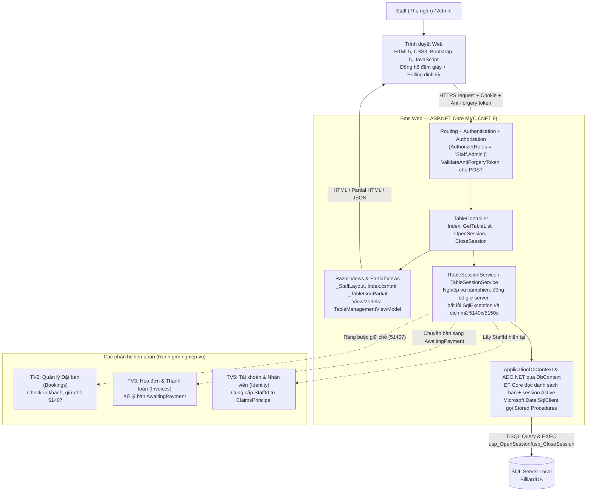
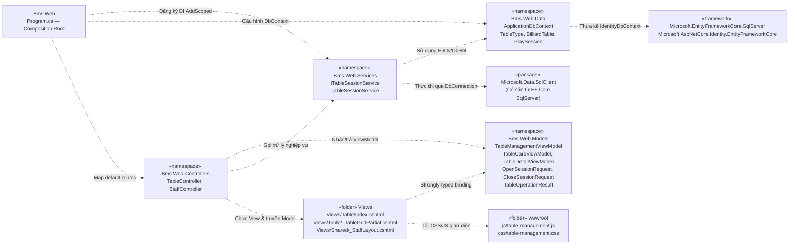
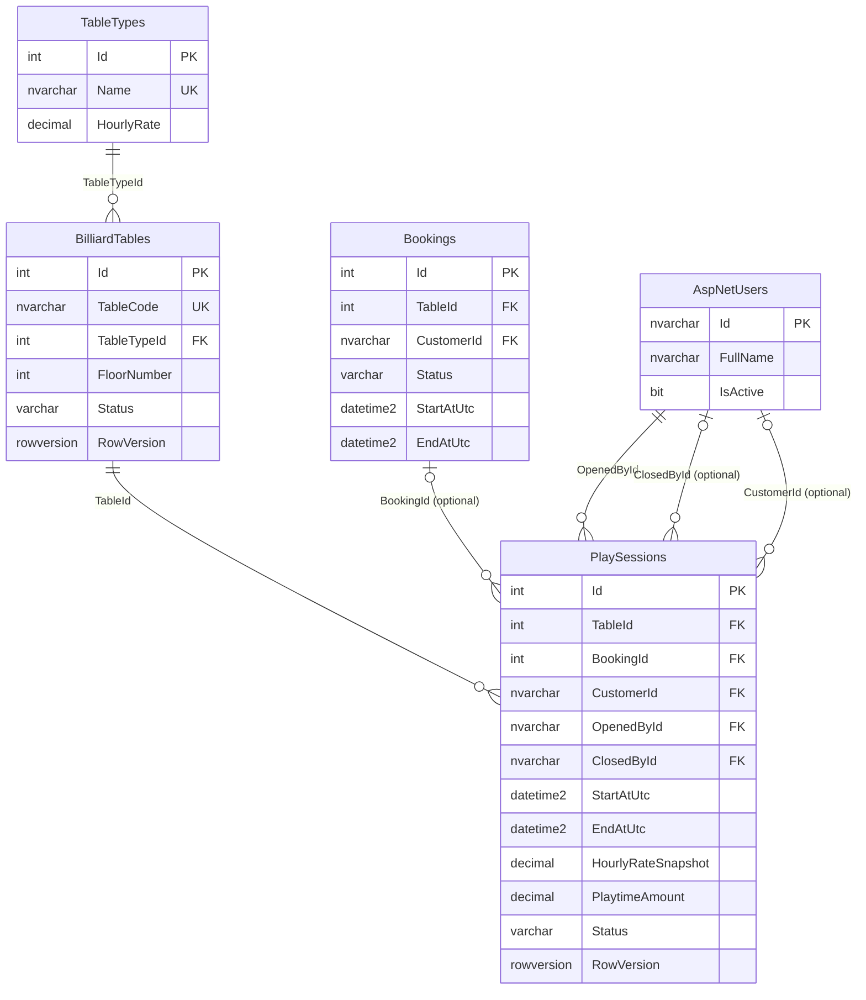
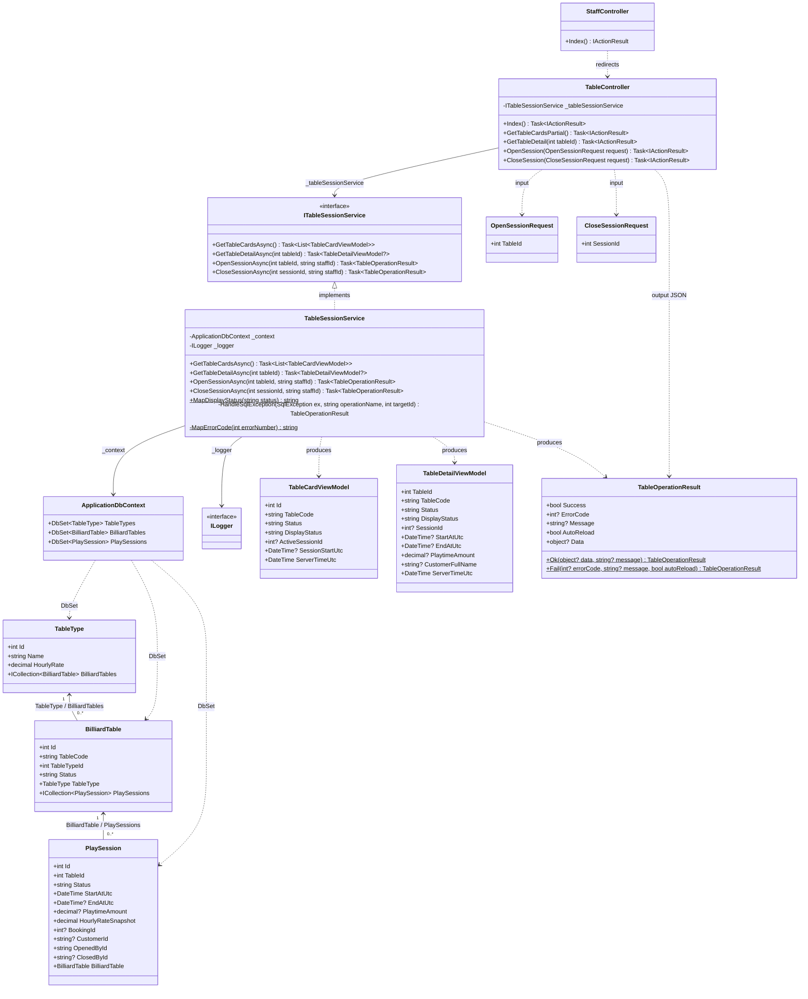
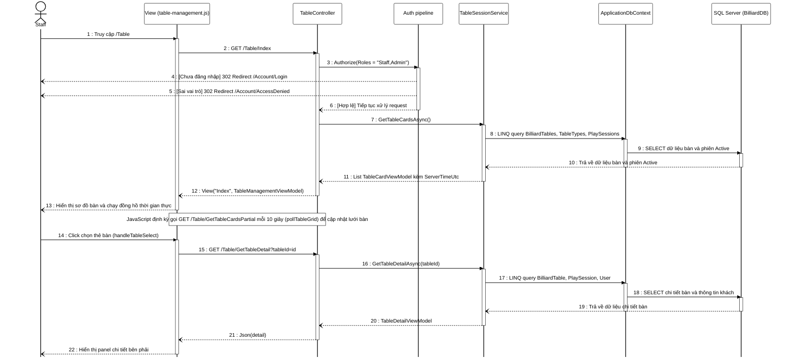
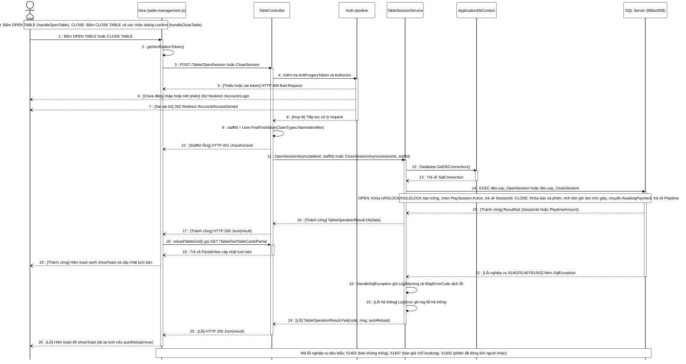

# Billiard Management System

## Software Design Specification — Phân hệ Quản lý Bàn & Phiên chơi

**Ngày cập nhật:** 04/10/2026. **Phiên bản:** 1.2. **Người phụ trách theo phân công:** Đoan (Thành viên 1).

Tài liệu cung cấp thiết kế kiến trúc, package, ba bảng dữ liệu và thiết kế chi tiết cho màn hình Quản lý bàn, luồng mở bàn (khách vãng lai) và đóng phiên chơi. Cấu trúc đánh số tương ứng mẫu SDS của nhóm; các mục I, II và III có thể ghép vào báo cáo chung. Nội dung giải thích bằng tiếng Việt; tên lớp, bảng, phương thức và stored procedure giữ nguyên tiếng Anh theo C# và SQL Server.

**Cách đọc trạng thái:** "Thiết kế" nghĩa là định hướng triển khai; "Hiện có" nghĩa là đã thấy trong mã nguồn hoặc script. "CẦN XÁC NHẬN" là điểm phụ thuộc thành viên khác hoặc chưa có quyết định cuối. "Disabled v1" là tính năng hiển thị trên giao diện nhưng chưa có logic.

Nguồn đối chiếu: `BMS_Database_Starter/BilliardDB_Full.sql` (dòng 128–148, 180–208, 491–578), `docs/sds-doan/DB_NOTES.md`, `src/Bms.Web/Program.cs`, `Data/ApplicationDbContext.cs`, `Controllers/StaffController.cs`, `Views/Shared/_AdminLayout.cshtml`. Repo nhắm **.NET 8**, dùng **ASP.NET Core MVC, Razor, Bootstrap, Identity và EF Core SQL Server 8.x**. Tên database: **BilliardDB**.

### Change Log

| Date | A / M / D | In charge | Change Description |
|---|---|---|---|
| 04/10/2026 | A | Đoan | Khởi tạo SDS phân hệ Quản lý Bàn & Phiên chơi theo khung SDS_HUNG.md, 9 điểm thiết kế và 7 sơ đồ Mermaid |
| 04/10/2026 | M | Đoan | Cập nhật v1.1: Đổi TableOperationResult sang Ok/Fail; bỏ BookingId ở v1 (chỉ mở vãng lai); chuẩn hóa 2 khóa UPDLOCK và hàm SYSUTCDATETIME() từ SQL thật; bổ sung 4 trường cho TableDetailViewModel; xóa mục OnModelCreating trong phụ lục; chuẩn hóa test D05/D06/D07; xác minh link tham khảo |
| 04/10/2026 | M | Đoan | Chốt Phương án A cho đường vào màn hình: sửa StaffController.Index() chuyển hướng sang TableController.Index(); cập nhật mục III.1.7 và phụ lục A1 |

---

# I. High Level Design

## 1. Software Architecture

### 1.1 Kiến trúc tổng thể

BMS sử dụng kiến trúc ASP.NET Core MVC trong một ứng dụng web duy nhất. Màn hình Quản lý bàn là giao diện POS (Point of Sale) của thu ngân/nhân viên: bên trái là lưới bàn trực quan, bên phải là panel chi tiết phiên đang chọn. Trình duyệt gửi yêu cầu HTTP đến `TableController`. Controller lấy định danh nhân viên từ cookie Identity (không nhận từ client), điều phối qua `TableSessionService`, kết quả trả về dưới dạng HTML đầy đủ (GET) hoặc JSON (POST và Partial Polling).

Gọi stored procedure thực hiện qua `Microsoft.Data.SqlClient` — package **đã có sẵn** từ dependency của `Microsoft.EntityFrameworkCore.SqlServer`, không cần cài thêm NuGet.



**Hình I.1 — Kiến trúc logic Phân hệ Quản lý Bàn & Phiên chơi.** Nét đứt biểu thị ranh giới nghiệp vụ với thành viên khác. `usp_CloseSession` chuyển bàn sang `AwaitingPayment`; việc giải phóng bàn về `Available` thuộc TV3 (thanh toán).

### 1.2 Architecture component descriptions

| No | Component | Description |
|---|---|---|
| C01 | Client tier — Web browser | Hiển thị lưới bàn POS và panel phiên. Không tự quyết trạng thái hay staffId; mọi logic nghiệp vụ do server xác nhận |
| A01 | Routing và security pipeline | Chọn action, xác thực cookie Identity, kiểm tra role `Staff` hoặc `Admin`; kiểm tra anti-forgery ở POST mở/đóng bàn |
| A05_Table | TableController | Tiếp nhận request xem bàn, mở phiên, đóng phiên. Lấy `StaffId` từ `ClaimsPrincipal`, không nhận từ form |
| A05_Svc | TableSessionService | Gọi stored procedure qua ADO.NET, dịch `SqlException.Number` sang thông báo tiếng Việt, map kết quả sang ViewModel. Đây là lớp duy nhất biết về `usp_OpenSession` và `usp_CloseSession` |
| A03 | Razor Views & ViewModels | `_StaffLayout.cshtml` theo wireframe POS; `Index.cshtml` layout 2 cột; `_TableGridPartial.cshtml` phục vụ Polling; `TableDetailViewModel` mang `ServerTimeUtc` để đồng hồ browser tự hiệu chỉnh |
| A06 | ApplicationDbContext / EF Core | `DbSet<TableType>`, `DbSet<BilliardTable>`, `DbSet<PlaySession>` phục vụ đọc danh sách. Stored procedure gọi qua `_context.Database.GetDbConnection()` — dùng chung connection pool |
| D01 | SQL Server — BilliardDB | Lưu trạng thái bàn và phiên, kiểm soát toàn vẹn qua PK, FK, CHECK, filtered unique index `UX_PlaySessions_ActiveTable`. Khóa đồng thời: `usp_OpenSession` dùng `WITH (UPDLOCK, HOLDLOCK)` trên `BilliardTables`; `usp_CloseSession` khóa `BilliardTables` bằng `WITH (UPDLOCK, HOLDLOCK)` VÀ khóa `PlaySessions` bằng `WITH (UPDLOCK)`. Procedure dùng `SYSUTCDATETIME()` để lấy thời gian UTC chuẩn xác |

### 1.3 Ranh giới trách nhiệm

Đoan phụ trách: xem danh sách bàn, mở phiên vãng lai (`usp_OpenSession`), theo dõi thời gian thực (đồng hồ browser), đóng phiên (`usp_CloseSession`), hiển thị tên khách hàng từ `PlaySession.CustomerId`. **Không** tự xây dựng: nghiệp vụ booking/check-in (TV2), hóa đơn/thanh toán (TV3), quản lý tài khoản (TV5). Nút `CONFIRM BOOKING`, `TRANSFER`, `SPLIT/MERGE` hiển thị trên giao diện (theo wireframe) nhưng ở trạng thái `disabled` — không có logic xử lý trong phiên bản v1.

Ứng dụng dùng cookie Identity; không có JWT. Schema do SQL scripts quản lý; không gọi `EnsureCreated`, `Migrate` hoặc áp migration lên BilliardDB đang có dữ liệu.

---

## 2. Package Diagram

### 2.1 Sơ đồ package



**Hình I.2 — Package Diagram.** Mũi tên nét đứt biểu thị dependency. Không có dependency ngược từ `Data` về `Controllers` hoặc `Services`. `Microsoft.Data.SqlClient` có sẵn theo transitive dependency của EF Core SQL Server — không cần khai báo thêm trong `.csproj`.

### 2.2 Package descriptions và quy ước đặt tên

| Package / thư mục | Trách nhiệm | Quy ước và ví dụ |
|---|---|---|
| `Bms.Web.Controllers` | Tiếp nhận HTTP, kiểm tra quyền, điều phối service, trả View hoặc JSON | PascalCase + hậu tố `Controller`: `TableController`; action: `Index`, `OpenSession`, `CloseSession` |
| `Bms.Web.Services` | Toàn bộ logic nghiệp vụ phiên chơi, gọi SP, dịch lỗi | PascalCase: `TableSessionService`; interface `ITableSessionService`; phương thức `Async` |
| `Bms.Web.Models` | ViewModel đầu vào/đầu ra, không bind entity trực tiếp từ form | Hậu tố `ViewModel` / `Request` / `Result`: `TableCardViewModel`, `OpenSessionRequest` |
| `Bms.Web.Data` (Entity) | Entity ánh xạ bảng SQL, data annotation thay Fluent API | PascalCase khớp tên bảng SQL: `TableType`, `BilliardTable`, `PlaySession` |
| `Views/Table` | Giao diện Razor theo action | `Index.cshtml`, `_TableGridPartial.cshtml` |
| `Views/Shared` | Layout và thành phần dùng chung | `_StaffLayout.cshtml` — layout POS riêng, không sửa `_AdminLayout.cshtml` |
| `wwwroot/js` | Script client: đồng hồ, polling, AJAX mở/đóng | `table-management.js` |
| `wwwroot/css` | Style bố cục POS và màu trạng thái | `table-management.css` |

Kiểu và public member dùng PascalCase; tham số/biến cục bộ dùng camelCase; dependency private dùng tiền tố `_`: `_service`, `_context`. Phương thức bất đồng bộ có hậu tố `Async`. Tên bảng và cột giữ đúng PascalCase của SQL script. Không nhận `StaffId`, `Role` hay `IsActive` từ form.

---

## 3. Database Design — Ba bảng của Đoan

### 3.0 Mô tả file và quan hệ

`BMS_Database_Starter/BilliardDB_Full.sql` khai báo ba bảng liên quan đến phân hệ này: `TableTypes` (dòng 128–134), `BilliardTables` (dòng 135–148), `PlaySessions` (dòng 180–208), và hai stored procedure `usp_OpenSession` (dòng 491–543), `usp_CloseSession` (dòng 545–578). ERD dưới đây chỉ thể hiện các bảng thuộc phạm vi phân hệ này và bảng `Bookings` như ranh giới nghiệp vụ.



**Hình I.3 — ERD rút gọn phân hệ Quản lý Bàn & Phiên chơi.** `Bookings` thuộc TV2; Đoan chỉ nhận ràng buộc gián tiếp qua lỗi `51407` do `usp_OpenSession` kiểm tra. `AspNetUsers` rút gọn chỉ liệt kê cột dùng trong phân hệ này.

### 3.1 TableTypes (Loại bàn)

**Mục đích:** danh mục loại bàn và đơn giá giờ cố định. **PK:** `Id`.

| Column | Kiểu dữ liệu | Nullable | Mặc định | Ràng buộc | Diễn giải |
|---|---|:---:|---|---|---|
| `Id` | `int` IDENTITY | NOT NULL | Tự tăng | **PK** `PK_TableTypes` | Mã loại bàn |
| `Name` | `nvarchar(50)` | NOT NULL | — | **UQ** `UQ_TableTypes_Name`; **CHECK** `LEN(LTRIM(RTRIM(Name))) > 0` | Tên loại: Pool, Carom |
| `HourlyRate` | `decimal(18,2)` | NOT NULL | — | **CHECK** `HourlyRate > 0` | Đơn giá giờ (VND), snapshot vào `PlaySessions.HourlyRateSnapshot` khi mở phiên |

**Dữ liệu seed:** Pool — 100.000 VND/h; Carom — 120.000 VND/h.

**Entity C# (`Data/Entities/TableType.cs`):**

```csharp
using System.ComponentModel.DataAnnotations;
using System.ComponentModel.DataAnnotations.Schema;

namespace Bms.Web.Data.Entities;

[Table("TableTypes")]
public class TableType
{
    public int Id { get; set; }

    [Required, MaxLength(50)]
    public string Name { get; set; } = string.Empty;

    [Column(TypeName = "decimal(18,2)")]
    public decimal HourlyRate { get; set; }

    public ICollection<BilliardTable> BilliardTables { get; set; } = [];
}
```

### 3.2 BilliardTables (Bàn bida)

**Mục đích:** danh sách bàn vật lý, trạng thái hoạt động hiện tại và token chống cập nhật đồng thời. **PK:** `Id`.

| Column | Kiểu dữ liệu | Nullable | Mặc định | Ràng buộc | Diễn giải |
|---|---|:---:|---|---|---|
| `Id` | `int` IDENTITY | NOT NULL | Tự tăng | **PK** `PK_BilliardTables` | Khóa chính bàn |
| `TableCode` | `nvarchar(20)` | NOT NULL | — | **UQ** `UQ_BilliardTables_Code`; **CHECK** không trắng | Mã hiển thị: B01, B02... |
| `TableTypeId` | `int` | NOT NULL | — | **FK** → `TableTypes(Id)` | Liên kết loại bàn |
| `FloorNumber` | `int` | NOT NULL | `1` | **CHECK** `>= 0` | Số tầng |
| `Status` | `varchar(20)` | NOT NULL | `'Available'` | **CHECK** `IN ('Available','InUse','AwaitingPayment','Maintenance','Inactive')` | Trạng thái bàn — xem Bảng 5 trạng thái mục III.1.6 |
| `RowVersion` | `rowversion` | NOT NULL | Hệ thống | — | Token chống cập nhật đồng thời — SQL Server tự quản lý |

**Index:** `IX_BilliardTables_Type_Status` trên `(TableTypeId, Status)`.

**Entity C# (`Data/Entities/BilliardTable.cs`):**

```csharp
using System.ComponentModel.DataAnnotations;
using System.ComponentModel.DataAnnotations.Schema;

namespace Bms.Web.Data.Entities;

[Table("BilliardTables")]
public class BilliardTable
{
    public int Id { get; set; }

    [Required, MaxLength(20)]
    public string TableCode { get; set; } = string.Empty;

    public int TableTypeId { get; set; }
    public TableType TableType { get; set; } = null!;

    public int FloorNumber { get; set; } = 1;

    [Required, MaxLength(20)]
    public string Status { get; set; } = "Available";

    [Timestamp]
    public byte[] RowVersion { get; set; } = [];

    public ICollection<PlaySession> PlaySessions { get; set; } = [];
}
```

### 3.3 PlaySessions (Phiên chơi bida)

**Mục đích:** ghi nhận một lượt chơi từ khi mở bàn đến khi đóng phiên; lưu giá giờ tại thời điểm mở. **PK:** `Id`.

| Column | Kiểu dữ liệu | Nullable | Mặc định | Ràng buộc | Diễn giải |
|---|---|:---:|---|---|---|
| `Id` | `int` IDENTITY | NOT NULL | Tự tăng | **PK** | Khóa chính phiên |
| `TableId` | `int` | NOT NULL | — | **FK** → `BilliardTables(Id)` | Bàn diễn ra phiên |
| `BookingId` | `int` | NULL | — | **FK** → `Bookings(Id)` | Lượt đặt trước, nếu có |
| `CustomerId` | `nvarchar(450)` | NULL | — | **FK** → `AspNetUsers(Id)` | Hội viên, nếu có |
| `OpenedById` | `nvarchar(450)` | NOT NULL | — | **FK** → `AspNetUsers(Id)` | Nhân viên mở bàn |
| `ClosedById` | `nvarchar(450)` | NULL | — | **FK** → `AspNetUsers(Id)` | Nhân viên đóng phiên |
| `StartAtUtc` | `datetime2(0)` | NOT NULL | — | — | Thời điểm mở, **UTC** — ghi bởi hàm `SYSUTCDATETIME()` trong `usp_OpenSession` |
| `EndAtUtc` | `datetime2(0)` | NULL | — | — | Thời điểm đóng, **UTC** — ghi bởi hàm `SYSUTCDATETIME()` trong `usp_CloseSession` |
| `HourlyRateSnapshot` | `decimal(18,2)` | NOT NULL | — | **CHECK** `> 0` | Giá giờ chốt tại thời điểm mở |
| `PlaytimeAmount` | `decimal(18,2)` | NULL | — | — | Tiền giờ chơi (tính và ghi khi đóng) |
| `Status` | `varchar(20)` | NOT NULL | `'Active'` | **CHECK** `IN ('Active','Closed')` | Trạng thái phiên |
| `RowVersion` | `rowversion` | NOT NULL | Hệ thống | — | Token chống cập nhật đồng thời |

**Ràng buộc vòng đời `CK_Session_Lifecycle`:** Khi `Status='Active'`: `EndAtUtc IS NULL`, `ClosedById IS NULL`, `PlaytimeAmount IS NULL`. Khi `Status='Closed'`: `EndAtUtc IS NOT NULL AND >= StartAtUtc`, `ClosedById IS NOT NULL`, `PlaytimeAmount IS NOT NULL AND >= 0`.

**Filtered Unique Indexes:**
- `UX_PlaySessions_ActiveTable` trên `(TableId) WHERE Status='Active'` — đảm bảo mỗi bàn tối đa 1 phiên Active.
- `UX_PlaySessions_Booking` trên `(BookingId) WHERE BookingId IS NOT NULL` — mỗi booking chỉ mở 1 phiên.

**Entity C# (`Data/Entities/PlaySession.cs`):**

```csharp
using System.ComponentModel.DataAnnotations;
using System.ComponentModel.DataAnnotations.Schema;

namespace Bms.Web.Data.Entities;

[Table("PlaySessions")]
public class PlaySession
{
    public int Id { get; set; }
    public int TableId { get; set; }
    public BilliardTable BilliardTable { get; set; } = null!;

    public int? BookingId { get; set; }

    [MaxLength(450)]
    public string? CustomerId { get; set; }

    [Required, MaxLength(450)]
    public string OpenedById { get; set; } = string.Empty;

    [MaxLength(450)]
    public string? ClosedById { get; set; }

    public DateTime StartAtUtc { get; set; }    // Đọc từ DB luôn SpecifyKind → Utc trước khi dùng
    public DateTime? EndAtUtc { get; set; }

    [Column(TypeName = "decimal(18,2)")]
    public decimal HourlyRateSnapshot { get; set; }

    [Column(TypeName = "decimal(18,2)")]
    public decimal? PlaytimeAmount { get; set; }

    [Required, MaxLength(20)]
    public string Status { get; set; } = "Active";

    [Timestamp]
    public byte[] RowVersion { get; set; } = [];
}
```

> [!NOTE]
> **Về `DateTime.Kind` khi đọc từ `datetime2(0)`:** EF Core ánh xạ `datetime2` sang `DateTime` với `Kind = DateTimeKind.Unspecified`. Trước khi xuất ra ViewModel hoặc JSON, service phải gọi `DateTime.SpecifyKind(session.StartAtUtc, DateTimeKind.Utc)` để tránh sai giờ khi browser xử lý. Xem chi tiết tại mục III.1.4.

### 3.4 Stored Procedures và Quy tắc tính tiền

#### usp_OpenSession

**Nguồn:** `BilliardDB_Full.sql` dòng 491–543.

| Tham số | Kiểu | Bắt buộc | Mô tả |
|---|---|:---:|---|
| `@TableId` | `int` | Có | ID bàn cần mở |
| `@StaffId` | `nvarchar(450)` | Có | ID nhân viên/admin từ Identity (do controller lấy từ `ClaimsPrincipal`) |
| `@BookingId` | `int` | Không (NULL) | ID lượt đặt trước nếu mở cho khách đã check-in (v1 truyền NULL) |
| `@CustomerId` | `nvarchar(450)` | Không (NULL) | ID hội viên (v1 truyền NULL) |

**Giá trị trả về:** Result set 1 dòng, 1 cột: `SessionId (int)` — ID phiên vừa tạo.

**Hàm lấy giờ trong procedure:** `SYSUTCDATETIME()` — trả `datetime2(0)` theo giờ UTC chuẩn của SQL Server.

**Cơ chế khóa trong procedure:** Khóa bản ghi bàn bằng `SELECT ... FROM dbo.BilliardTables t WITH (UPDLOCK, HOLDLOCK) WHERE t.Id = @TableId` nhằm ngăn chặn các giao dịch mở bàn hoặc sửa trạng thái đồng thời trên cùng bàn.

#### usp_CloseSession

**Nguồn:** `BilliardDB_Full.sql` dòng 545–578.

| Tham số | Kiểu | Bắt buộc | Mô tả |
|---|---|:---:|---|
| `@SessionId` | `int` | Có | ID phiên Active cần đóng |
| `@StaffId` | `nvarchar(450)` | Có | ID nhân viên/admin thực hiện đóng |

**Giá trị trả về:** Result set 1 dòng: `Id, StartAtUtc, EndAtUtc, HourlyRateSnapshot, PlaytimeAmount, Status`.

**Hàm lấy giờ trong procedure:** `SYSUTCDATETIME()` — đồng nhất với usp_OpenSession.

**Cơ chế khóa trong procedure:**
1. Khóa bản ghi bàn liên quan bằng `SELECT @LockedId = Id FROM dbo.BilliardTables WITH (UPDLOCK, HOLDLOCK) WHERE Id = @TableId;`
2. Khóa bản ghi phiên chơi bằng `SELECT @Status = Status, @Start = StartAtUtc, @Rate = HourlyRateSnapshot, @BookingId = BookingId FROM dbo.PlaySessions WITH (UPDLOCK) WHERE Id = @SessionId;`

#### Quy tắc tính tiền và làm tròn

$$\text{PlaytimeAmount} = \text{ROUND}\!\left(\frac{\text{DATEDIFF\_BIG(second, StartAtUtc, EndAtUtc)} \times \text{HourlyRateSnapshot}}{3600.0},\; 0\right)$$

- **Đơn vị thời gian:** từng giây thực tế (`DATEDIFF_BIG(second, ...)`), không làm tròn theo phút.
- **Làm tròn:** đến đồng nguyên (0 chữ số thập phân, làm tròn thương mại `ROUND(..., 0)`).
- **Phí tối thiểu:** không áp dụng trong v1.
- **Đơn giá áp dụng:** `HourlyRateSnapshot` — giá chốt tại thời điểm mở, độc lập với thay đổi sau này trong `TableTypes.HourlyRate`.

---

# II. Detailed Code Design

## 1. Quản lý bàn và phiên chơi

### 1.1 Class Diagram



**Hình II.1 — Class Diagram Phân hệ Quản lý Bàn và Phiên chơi.** Các thành viên trong sơ đồ phản ánh chính xác 100% mã nguồn thực tế. Nhằm đảm bảo sơ đồ trực quan và vừa vặn một trang báo cáo, các thuộc tính của Entity và ViewModel được rút gọn tập trung vào các trường khóa và trạng thái phục vụ luồng nghiệp vụ. 

> [!NOTE]
> - **Kiểm soát quan hệ:** Entity `PlaySession` chỉ lưu các scalar foreign key (`BookingId`, `CustomerId`, `OpenedById`, `ClosedById`) mà không khai báo navigation property tới `ApplicationUser` hay `Booking`. Việc đọc họ tên khách hàng (`CustomerFullName`) được `TableSessionService` thực hiện qua phép LINQ JOIN với bảng `_context.Users`.
> - **Cơ chế gọi Stored Procedure:** `TableSessionService` sử dụng kết nối `SqlConnection` lấy từ `_context.Database.GetDbConnection()` để gọi trực tiếp các Stored Procedure `usp_OpenSession` và `usp_CloseSession`, dùng chung connection pool với Entity Framework Core.
> - **Điều hướng:** `StaffController` chỉ chứa action `Index()` thực hiện chuyển hướng (`RedirectToAction`) sang `TableController.Index()`.

| Class | Trách nhiệm |
|---|---|
| `TableController` | Tiếp nhận yêu cầu HTTP từ giao diện nhân viên, kiểm tra quyền và xác thực token CSRF, trích xuất `StaffId` từ `ClaimsPrincipal`, điều phối service và trả về Razor View hoặc JSON. |
| `StaffController` | Điểm vào nghiệp vụ của nhân viên từ layout chung; chuyển hướng sang `TableController.Index()`. |
| `ITableSessionService` | Interface trừu tượng hóa nghiệp vụ bàn và phiên chơi, cho phép phân tách lỏng và phục vụ kiểm thử đơn vị. |
| `TableSessionService` | Triển khai logic nghiệp vụ bàn: đọc danh sách bàn và chi tiết bàn qua EF Core, gọi Stored Procedure qua ADO.NET, dịch mã lỗi SQL sang tiếng Việt và điều phối logging qua `ILogger`. |
| `ApplicationDbContext` | Lớp ngữ cảnh cơ sở dữ liệu Entity Framework Core; cung cấp các `DbSet` (`TableTypes`, `BilliardTables`, `PlaySessions`) và quản lý kết nối CSDL chung. |
| `ILogger` | Thành phần logging framework ghi nhận các cảnh báo nghiệp vụ (`LogWarning`) và nhật ký lỗi hệ thống (`LogError`). |
| `TableType` | Thực thể ánh xạ bảng `TableTypes`, định nghĩa danh mục loại bàn (Pool, Carom) và đơn giá giờ cố định. |
| `BilliardTable` | Thực thể ánh xạ bảng `BilliardTables`, quản lý mã bàn, vị trí tầng, trạng thái vật lý và liên kết phiên chơi. |
| `PlaySession` | Thực thể ánh xạ bảng `PlaySessions`, lưu vết vòng đời phiên chơi từ khi mở đến khi đóng và chốt tiền giờ. |
| `TableCardViewModel` | Mô hình dữ liệu hiển thị thẻ bàn trên sơ đồ POS (mã bàn, trạng thái, giờ bắt đầu phiên và thời gian server UTC). |
| `TableDetailViewModel` | Mô hình dữ liệu hiển thị panel chi tiết bên phải (thông tin bàn, khách hàng, thời gian chơi, giá snapshot và tiền giờ chốt). |
| `OpenSessionRequest` | Mô hình nhận dữ liệu `[FromForm]` khi nhân viên yêu cầu mở bàn (`TableId`). |
| `CloseSessionRequest` | Mô hình nhận dữ liệu `[FromForm]` khi nhân viên yêu cầu đóng phiên (`SessionId`). |
| `TableOperationResult` | Cấu trúc phản hồi JSON đồng nhất cho mọi thao tác POST: cờ thành công, mã lỗi, thông báo hiển thị, dữ liệu kèm theo và cờ tự động tải lại lưới (`AutoReload`). |

---

### 1.2 Sequence Diagram — Xem danh sách bàn và theo dõi thời gian thực

**Actor:** Nhân viên (`Staff`) hoặc Quản trị viên (`Admin`).  
**Route:** `GET /Table`, `GET /Table/GetTableCardsPartial`, `GET /Table/GetTableDetail`.  
**Điều kiện trước:** Người dùng đã đăng nhập với Cookie xác thực hợp lệ và thuộc role `Staff` hoặc `Admin` (`[Authorize(Roles = "Staff,Admin")]`).  
**Kết quả:** Hiển thị sơ đồ bàn POS; đồng hồ đếm giờ tự động cập nhật thời gian thực; panel chi tiết hiển thị đầy đủ thông tin bàn được chọn.



**Mô tả chi tiết các cơ chế phía trình duyệt (`table-management.js`):**
1. **Đồng hồ thời gian thực và Bù lệch giờ (Clock Skew):**
   - Khi tải trang hoặc nhận HTML từ polling, JavaScript đọc thuộc tính `data-server-time` của phần tử `#table-grid` để tính độ lệch thời gian: `deltaOffset = Date.now() - parsedServerTime`.
   - Một hàm đếm nhịp `updateClocks` được kích hoạt mỗi 1 giây (`setInterval(updateClocks, 1000)`). Hàm này duyệt qua tất cả thẻ bàn có thuộc tính `data-session-start`, tính số giây đã trôi qua dựa trên `(Date.now() - deltaOffset) - startParsed`, định dạng thành chuỗi `HH:mm:ss` và cập nhật trực tiếp vào DOM (`.table-clock`).
   - Nếu panel chi tiết bên phải đang hiển thị và bàn đang chọn có phiên Active, trường `Duration` của panel cũng được cập nhật đồng thời mỗi giây.
2. **Page Visibility API:**
   - Script lắng nghe sự kiện `visibilitychange` trên `document`. Khi người dùng chuyển sang tab khác (`document.hidden = true`), quá trình polling định kỳ và cập nhật đồng hồ được tạm hoãn để tiết kiệm tài nguyên. Ngay khi tab được kích hoạt trở lại, script lập tức cập nhật lại đồng hồ và gửi một yêu cầu polling để làm mới lưới bàn.
3. **Quản lý Panel chi tiết bên phải:**
   - Mặc định khi tải trang, panel chi tiết được ẩn bằng class `d-none`.
   - Khi nhân viên click vào một thẻ bàn hoặc nhấn `Enter`/`Space`, panel được hiển thị (`classList.remove('d-none')`), thẻ bàn được gắn viền sáng (`selected`) và gửi yêu cầu `GetTableDetail`.
   - Nhân viên có thể đóng panel bằng nút đóng ✕ (`#btn-close-detail`) hoặc nhấn phím `Escape`. Khi đóng, hàm `closeDetailPanel` dọn dẹp các trường dữ liệu, bỏ viền sáng thẻ bàn và tự động trả con trỏ focus về thẻ bàn vừa thao tác (`lastSelectedCardId.focus()`) nhằm hỗ trợ điều hướng bàn phím hoàn hảo.
   - Nếu qua một chu kỳ polling mà bàn đang chọn không còn tồn tại trên sơ đồ, hàm `resetDetailPanel` sẽ tự động ẩn panel để tránh hiển thị sai lệch.

---

### 1.3 Sequence Diagram — Mở bàn và đóng phiên chơi (Sơ đồ gộp)

**Actor:** Nhân viên (`Staff`) hoặc Quản trị viên (`Admin`).  

**Route:**
- **OPEN:** `POST /Table/OpenSession` (nhận `TableId` và `__RequestVerificationToken`).
- **CLOSE:** `POST /Table/CloseSession` (nhận `SessionId` và `__RequestVerificationToken`).

**Điều kiện trước:**
- **OPEN:** Bàn đang ở trạng thái `Available` (Trống); Cookie phiên làm việc hợp lệ với role `Staff` hoặc `Admin`.
- **CLOSE:** Bàn đang ở trạng thái `InUse` và phiên chơi đang có `Status = 'Active'`; Cookie phiên làm việc hợp lệ với role `Staff` hoặc `Admin`.

**Kết quả:**
- **OPEN:** Bàn chuyển sang `InUse`, tạo bản ghi phiên mới với `Status = 'Active'` trong `PlaySessions`; đồng hồ bắt đầu chạy; hoặc nhận thông báo lỗi tiếng Việt nếu thao tác bị từ chối.
- **CLOSE:** Phiên chơi chuyển sang `Status = 'Closed'`, tiền giờ được chốt; bàn chuyển sang trạng thái `AwaitingPayment` (chờ thanh toán); hiển thị số tiền giờ phải thu trên giao diện.



**Mô tả chi tiết xử lý kỹ thuật:**
- **Xác nhận người dùng và CSRF:** 
  - Với thao tác mở bàn, nhân viên nhấn nút OPEN TABLE trên panel chi tiết (`handleOpenTable`).
  - Với thao tác đóng phiên, JavaScript hiển thị hộp thoại xác nhận `window.confirm("Bạn có chắc chắn muốn đóng phiên cho bàn ...?")` (`handleCloseTable`) nhằm ngăn chặn đóng nhầm.
  - Yêu cầu được gửi qua Fetch API với `Content-Type: application/x-www-form-urlencoded`. Token chống giả mạo được lấy từ phần tử ẩn `@Html.AntiForgeryToken()` bằng hàm `getVerificationToken()` và đóng gói cùng tham số qua `URLSearchParams`. `TableController` áp dụng bộ lọc `[ValidateAntiForgeryToken]`. Nếu thiếu hoặc sai token, ASP.NET Core từ chối ngay với HTTP 400 Bad Request.
- **Bảo mật danh tính và quyền hạn:** Controller áp dụng `[Authorize(Roles = "Staff,Admin")]`. Nếu chưa đăng nhập hoặc cookie hết hạn, hệ thống chuyển hướng về `/Account/Login`. Nếu sai vai trò, chuyển hướng về `/Account/AccessDenied`. Controller tuyệt đối không nhận `StaffId` từ client mà trích xuất từ Claims qua `User.FindFirstValue(ClaimTypes.NameIdentifier)`. Nếu `StaffId` rỗng, controller trả về HTTP 401 Unauthorized.
- **Thực thi Stored Procedure:** `TableSessionService` lấy đối tượng `SqlConnection` từ DbContext qua `Database.GetDbConnection()`, mở kết nối và gán tham số an toàn qua `SqlParameter`:
  - `usp_OpenSession`: Đặt khóa `WITH (UPDLOCK, HOLDLOCK)` trên bản ghi bàn, kiểm tra `Status = 'Available'`, kiểm tra giữ chỗ booking, tạo bản ghi `PlaySessions` mới (`Status = 'Active'`) và trả về `SessionId`.
  - `usp_CloseSession`: Đặt khóa trên bàn và phiên, tính tiền giờ làm tròn theo công thức $\text{ROUND}\left(\frac{\text{DATEDIFF\_BIG(second, StartAtUtc, EndAtUtc)} \times \text{HourlyRateSnapshot}}{3600.0}, 0\right)$, chuyển bàn sang `AwaitingPayment`, đóng phiên (`Status = 'Closed'`) và trả về `PlaytimeAmount`.
- **Xử lý phản hồi và mã lỗi:**
  - Khi thành công: Controller trả HTTP 200 kèm `TableOperationResult.Ok`. JavaScript hiển thị Toast xanh thông báo và tự động gọi `reloadTableGrid()` (`GET /Table/GetTableCardsPartial`) để làm mới lưới bàn.
  - Khi gặp lỗi nghiệp vụ CSDL (mã `51402` bàn không trống, `51407` bàn giữ chỗ booking, hoặc `51502` phiên đã đóng bởi người khác): Service bắt `SqlException`, ghi nhật ký cảnh báo qua `_logger.LogWarning`, dịch mã lỗi sang thông báo tiếng Việt qua `MapErrorCode` và trả về `AutoReload = true`. Giao diện hiển thị Toast đỏ và tự động tải lại lưới bàn để đồng bộ trạng thái mới nhất.
  - Khi gặp lỗi hệ thống không xác định: Service ghi nhật ký lỗi qua `_logger.LogError` và trả về `AutoReload = false`. Giao diện hiển thị Toast đỏ và giữ nguyên trạng thái màn hình.


---

# III. Other Design Specifications

## 1. Cơ chế phân quyền và bảo mật

### 1.1 Xác thực, quản lý phiên và bảo vệ CSRF

BMS dùng ASP.NET Core Identity với cookie authentication — đồng nhất với cấu hình của Hùng (`Program.cs`). `TableController` yêu cầu `[Authorize(Roles = "Staff,Admin")]`; mọi action thay đổi dữ liệu dùng thêm `[ValidateAntiForgeryToken]`.

**Lấy `StaffId` an toàn tại server — không nhận từ client:**

```csharp
// Trong TableController.OpenSession và CloseSession:
var staffId = User.FindFirstValue(ClaimTypes.NameIdentifier);
if (string.IsNullOrEmpty(staffId))
    return Unauthorized();
```

**Gửi anti-forgery token từ JavaScript (AJAX mở bàn vãng lai v1):**

```javascript
// table-management.js
const token = document.querySelector('input[name="__RequestVerificationToken"]').value;
const response = await fetch('/Table/OpenSession', {
    method: 'POST',
    headers: {
        'Content-Type': 'application/json',
        'RequestVerificationToken': token
    },
    body: JSON.stringify({ tableId: selectedTableId })
});
```

### 1.2 Ma trận quyền cho phân hệ Quản lý bàn

| Chức năng | Chưa đăng nhập | Admin | Staff | Customer |
|---|---|---|---|---|
| Xem lưới bàn (`GET /Table`) | Không | Có | Có | Không |
| Xem chi tiết phiên (`GET /Table/GetTableDetail`) | Không | Có | Có | Không |
| Mở bàn vãng lai (`POST /Table/OpenSession`) | Không | Có | Có | Không |
| Đóng phiên (`POST /Table/CloseSession`) | Không | Có | Có | Không |
| Nút CONFIRM BOOKING | — | Hiển thị (disabled v1) | Hiển thị (disabled v1) | — |
| Nút TRANSFER | — | Hiển thị (disabled v1) | Hiển thị (disabled v1) | — |
| Nút SPLIT/MERGE | — | Hiển thị (disabled v1) | Hiển thị (disabled v1) | — |

Server luôn kiểm tra cookie và role trước khi xử lý; không dựa vào hidden input hay tham số từ client để quyết định quyền.

### 1.3 Kỹ thuật gọi Stored Procedure và Xử lý lỗi

#### Phương án lựa chọn: ADO.NET qua `DbContext.Database.GetDbConnection()`

Hai phương án khả thi không cần cài thêm NuGet package và không tạo migration:

| # | Phương án | Ưu điểm | Hạn chế |
|---|---|---|---|
| **1** | EF Core 8 `Database.SqlQueryRaw<T>` | Code ngắn gọn, trả về DTO strongly-typed | Tùy ngữ cảnh thực thi, EF Core có thể wrap câu lệnh thành subquery `SELECT ... FROM (EXEC usp_...) AS t` gây lỗi cú pháp trên SQL Server. Không trực tiếp bắt được `SqlException.Number` một cách tường minh |
| **2** | `DbContext.Database.GetDbConnection()` + `SqlCommand` | Gọi trực tiếp SP theo `CommandType.StoredProcedure`, không sinh subquery, bắt chính xác `SqlException.Number`, dùng chung connection pool | Cần map kết quả thủ công (~15 dòng code) |

**Đề xuất:** Chọn **Phương án 2** trong `TableSessionService`. Không cần cài thêm NuGet vì `Microsoft.Data.SqlClient` đã có sẵn qua transitive dependency của `Microsoft.EntityFrameworkCore.SqlServer`.

**Cách mở và đóng kết nối an toàn:**

```csharp
// TableSessionService.cs — mở / đóng connection an toàn
public async Task<TableOperationResult> OpenSessionAsync(int tableId, string staffId)
{
    var conn = (SqlConnection)_context.Database.GetDbConnection();
    var shouldClose = conn.State == ConnectionState.Closed;
    try
    {
        if (shouldClose) await conn.OpenAsync();

        using var cmd = conn.CreateCommand();
        cmd.CommandText = "dbo.usp_OpenSession";
        cmd.CommandType = CommandType.StoredProcedure;
        cmd.Parameters.Add(new SqlParameter("@TableId",   SqlDbType.Int)           { Value = tableId });
        cmd.Parameters.Add(new SqlParameter("@StaffId",   SqlDbType.NVarChar, 450) { Value = staffId });
        cmd.Parameters.Add(new SqlParameter("@BookingId", SqlDbType.Int)           { Value = DBNull.Value });
        cmd.Parameters.Add(new SqlParameter("@CustomerId",SqlDbType.NVarChar, 450) { Value = DBNull.Value });

        using var reader = await cmd.ExecuteReaderAsync();
        if (await reader.ReadAsync())
        {
            int sessionId = reader.GetInt32(0);
            return TableOperationResult.Ok(new { SessionId = sessionId });
        }
        return TableOperationResult.Fail(0, "Stored procedure không trả về kết quả.", false);
    }
    catch (SqlException ex)
    {
        return TableOperationResult.Fail(ex.Number, MapErrorCode(ex.Number), autoReload: true);
    }
    finally
    {
        if (shouldClose && conn.State == ConnectionState.Open)
            await conn.CloseAsync();
    }
}
```

#### Bảng dịch mã lỗi sang thông báo tiếng Việt

```csharp
private static string MapErrorCode(int errorNumber) => errorNumber switch
{
    51401 => "Thao tác yêu cầu tài khoản Nhân viên hoặc Quản trị viên đang hoạt động.",
    51402 => "Bàn hiện không ở trạng thái Trống để có thể mở phiên.",
    51403 => "Bàn này đã có một phiên chơi đang hoạt động.",
    51404 => "Lượt đặt bàn không hợp lệ (chưa check-in, sai bàn hoặc đã hết hạn giữ chỗ).",
    51405 => "Khách hàng không khớp với thông tin người đặt trước.",
    51406 => "Lượt đặt bàn này đã được mở phiên chơi trước đó.",
    51407 => "Bàn đang được giữ chỗ cho khách đặt trước trong khung giờ này.",
    51408 => "Tài khoản hội viên của khách hàng không tồn tại hoặc đang bị khóa.",
    51501 => "Thao tác đóng phiên yêu cầu quyền Nhân viên hoặc Quản trị viên đang hoạt động.",
    51502 => "Phiên chơi không còn ở trạng thái Hoạt động (có thể đã được nhân viên khác đóng).",
    _     => $"Lỗi hệ thống (mã {errorNumber}). Vui lòng thử lại hoặc liên hệ quản trị viên."
};
```

### 1.4 Xử lý thời gian: UTC, UTC+7 và Clock Skew

#### Quy ước lưu trữ và hiển thị

- **Lưu DB:** 100% cột thời gian dùng `datetime2(0)` lưu UTC, ghi bởi hàm `SYSUTCDATETIME()` trong stored procedure — không phụ thuộc múi giờ instance SQL Server.
- **Hiển thị:** Mọi mốc thời gian hiển thị cho thu ngân đều chuyển sang **Giờ Việt Nam (UTC+7 / Asia/Ho_Chi_Minh)**.

#### Vấn đề `DateTime.Kind = Unspecified`

EF Core đọc `datetime2(0)` lên C# thành `DateTime` với `Kind = DateTimeKind.Unspecified`. Nếu serialize thẳng sang JSON, không có đuôi `Z`, browser sẽ hiểu là giờ local của server — sai múi giờ.

**Khắc phục trong service trước khi đưa vào ViewModel:**

```csharp
// Luôn gọi sau khi đọc từ EF hoặc SqlDataReader:
var startUtc = DateTime.SpecifyKind(session.StartAtUtc, DateTimeKind.Utc);
// Serialize JSON → "2026-10-04T13:23:00Z" — browser tự đọc đúng UTC
```

#### Khắc phục lệch giờ máy trạm (Clock Skew Compensation)

Đồng hồ đếm giây trong browser phải đồng bộ với server để tránh hiển thị sai (do đồng hồ máy thu ngân bị sai giờ).

**Server:** Mỗi lần trả `TableCardViewModel`, gắn thêm:

```csharp
ServerTimeUtc = DateTime.UtcNow  // serialize → "2026-10-04T13:23:05Z"
```

**Client JavaScript — khởi tạo và hiệu chỉnh:**

```javascript
// Khi tải trang lần đầu hoặc sau mỗi lần poll:
const serverTimeUtc = new Date(data.serverTimeUtc);  // ISO-8601 UTC
const deltaOffset = Date.now() - serverTimeUtc.getTime(); // ms lệch giữa browser và server

// Trong setInterval mỗi 1s:
function tick() {
    const correctedNow = Date.now() - deltaOffset;
    tables.forEach(table => {
        if (!table.sessionStartUtc) return;
        const startMs = new Date(table.sessionStartUtc).getTime();
        const seconds = Math.max(0, Math.floor((correctedNow - startMs) / 1000));
        const hh = String(Math.floor(seconds / 3600)).padStart(2, '0');
        const mm = String(Math.floor((seconds % 3600) / 60)).padStart(2, '0');
        const ss = String(seconds % 60).padStart(2, '0');
        document.getElementById(`clock-${table.id}`).textContent = `${hh}:${mm}:${ss}`;
    });
}
```

### 1.5 Cơ chế làm mới danh sách (Polling v1 / SignalR v2)

#### Phiên bản v1: Polling định kỳ

```javascript
// table-management.js
const POLL_INTERVAL = 10_000; // 10 giây

function startPolling() {
    setInterval(async () => {
        if (document.hidden) return; // Page Visibility API — tiết kiệm tài nguyên
        const resp = await fetch('/Table/GetTableCardsPartial');
        if (!resp.ok) return;
        const html = await resp.text();
        const selectedId = getSelectedTableId(); // giữ lại bàn đang chọn
        document.getElementById('table-grid').innerHTML = html;
        reAttachClickListeners();
        restoreSelectedTable(selectedId);
        recalculateDeltaOffset(); // tái tính từ ServerTimeUtc mới trong partial
    }, POLL_INTERVAL);
}
```

#### Phiên bản v2 (nâng cấp sau): ASP.NET Core SignalR

- Thêm `builder.Services.AddSignalR()` và `TableHub : Hub`.
- Server gọi `_hubContext.Clients.All.SendAsync("ReceiveTableUpdated")` sau mỗi lần mở/đóng bàn thành công.
- Client lắng nghe và gọi `reloadTableGrid()` ngay lập tức — không polling.

### 1.6 Thiết kế giao diện và Layout

#### Bảng 5 trạng thái bàn (phiên bản v1)

| `BilliardTables.Status` | Nhãn hiển thị | Màu Badge | Hành vi "OPEN TABLE" | Hành vi "CLOSE TABLE" |
|---|---|---|---|---|
| `Available` | **Trống** | Xanh lá (`#10b981`) | **Bật** | Tắt (`disabled`) |
| `InUse` | **Đang chơi** | Đỏ (`#e94560`) | Tắt (`disabled`) | **Bật** |
| `AwaitingPayment` | **Chờ thanh toán** | Vàng (`#f59e0b`) | Tắt (`disabled`) | Tắt (`disabled`) |
| `Maintenance` | **Bảo trì** | Xám (`#94a3b8`) | Tắt (`disabled`) | Tắt (`disabled`) |
| `Inactive` | **Ngừng hoạt động** | Xám đậm (`#475569`) | Tắt (`disabled`) | Tắt (`disabled`) |

> [!NOTE]
> Nếu bàn ở trạng thái `Available` nhưng có booking đang giữ chỗ (`51407`), procedure tự chặn và ném lỗi; giao diện chỉ hiển thị thông báo tiếng Việt tương ứng (`"Bàn đang được giữ chỗ cho khách đặt trước..."`), không có logic riêng phía client.

#### Bố cục màn hình (theo Wireframe `wireframe-table-management.png`)

- **Cột trái:** Lưới thẻ bàn (`_TableGridPartial.cshtml`). Mỗi thẻ hiển thị `TableCode`, `DisplayStatus` và đồng hồ (chỉ bàn `InUse`).
- **Cột phải:** Panel chi tiết phiên chọn: Table Name, Status, Customer (FullName từ `AspNetUsers` hoặc `--`), Booking Time (`--` ở v1). Nút `CONFIRM BOOKING`, `TRANSFER`, `SPLIT/MERGE` hiển thị theo wireframe nhưng `disabled`.

#### Layout: `_StaffLayout.cshtml` riêng (không dùng `_AdminLayout.cshtml`)

**Lý do kỹ thuật:**
1. `_AdminLayout.cshtml` hardcode `user-role: Administrator` trong sidebar footer và sidebar nav chứa các link Admin (`/Employee`) — sai ngữ cảnh với màn hình thu ngân.
2. Màn hình POS cần layout full-width không sidebar để tối đa diện tích lưới bàn.
3. Tách layout tránh xung đột khi merge code với Hùng (TV5).

### 1.7 Đường vào màn hình — Đã chốt

> [!NOTE]
> **Quyết định thiết kế (Đã chốt):** Chọn **Phương án A — StaffController chuyển hướng**.
>
> **Chi tiết triển khai:**
> - Sau khi nhân viên (role `Staff`) đăng nhập thành công, luồng điều hướng mặc định của hệ thống Identity chuyển về route `/Staff` (tương ứng `StaffController.Index()`).
> - Action `StaffController.Index()` thực hiện chuyển hướng (`RedirectToAction("Index", "Table")`) sang màn hình Quản lý bàn (`TableController.Index()`).
> - **Tập tin cần sửa:** `Controllers/StaffController.cs` (sửa 1 dòng trong action `Index()`).
> - **Lý do lựa chọn:** Giữ nguyên vẹn logic đăng nhập trong `AccountController.cs` của TV5 (Hùng), không can thiệp vào mã điều phối tài khoản chung, loại bỏ hoàn toàn rủi ro xung đột mã nguồn khi tích hợp giữa các thành viên.

---

## 2. Tiêu chí kiểm tra phần Đoan

| ID | Tình huống | Cách thực hiện kiểm thử | Kết quả mong đợi |
|---|---|---|---|
| D01 | Staff truy cập `/Table` khi chưa đăng nhập | Trình duyệt ẩn danh truy cập trực tiếp `GET /Table` | Redirect `/Account/Login` |
| D02 | Customer truy cập `/Table` | Đăng nhập tài khoản Customer rồi truy cập `GET /Table` | HTTP 403 hoặc redirect AccessDenied |
| D03 | Staff đăng nhập hợp lệ xem danh sách bàn | Đăng nhập Staff vào `/Table` | Hiển thị 6 bàn đúng trạng thái theo seed data |
| D04 | Mở bàn `Available` (B02 hoặc B03) | Bấm chọn B02, bấm "OPEN TABLE" | Phiên Active tạo, bàn chuyển `InUse`, đồng hồ chạy |
| D05 | Mở bàn đang `InUse` (B01) | Nút trên UI đã disabled; kiểm thử bằng cách mở 2 tab cùng bấm mở một bàn trống đồng thời, hoặc gửi POST thủ công qua DevTools fetch | Nhận lỗi 51402 hoặc 51403, toast đỏ "Bàn này đã có phiên chơi đang hoạt động", lưới tự tải lại |
| D06 | Mở bàn `Maintenance` (B05) | Nút trên UI đã disabled; kiểm thử bằng cách gửi POST thủ công với `tableId` của B05 qua DevTools fetch | Nhận lỗi 51402, toast đỏ "Bàn hiện không ở trạng thái Trống...", lưới tự tải lại |
| D07 | Mở bàn khi booking giữ chỗ (dùng bàn B06) | Bàn B06 đang `Available` nhưng có booking check-in trước 10 phút. Nút "OPEN TABLE" bật; bấm mở vãng lai | Nhận lỗi 51407, toast đỏ "Bàn đang được giữ chỗ cho khách đặt trước trong khung giờ này.", lưới tự tải lại |
| D08 | Đóng phiên hợp lệ | Bấm chọn bàn B01 (`InUse`), bấm "CLOSE TABLE", xác nhận | Phiên `Closed`, `PlaytimeAmount` ghi đúng, bàn `AwaitingPayment`, toast hiện tổng tiền |
| D09 | Hai nhân viên cùng bấm "Mở bàn" | Mở 2 tab/trình duyệt, bấm mở cùng 1 bàn cách nhau <1 giây | Nhân viên thứ hai nhận lỗi tiếng Việt, lưới tự động tải lại trạng thái mới |
| D10 | Hai nhân viên cùng bấm "Đóng phiên" | Mở 2 tab, cùng bấm đóng phiên của bàn B01 | Nhân viên thứ hai nhận lỗi 51502 tiếng Việt, lưới tự động tải lại |
| D11 | POST thiếu anti-forgery token | Gửi request qua Postman hoặc bỏ header token | Framework từ chối 400 Bad Request trước khi vào action |
| D12 | Form gửi kèm `staffId` giả mạo | Thêm `staffId: "hacker"` vào body | `staffId` bị bỏ qua; server dùng `ClaimsPrincipal` |
| D13 | Đồng hồ máy thu ngân bị sai ±30 phút | Đổi giờ máy client lệch 30 phút | Đồng hồ hiển thị trên browser vẫn đếm đúng nhờ `deltaOffset` |
| D14 | Polling 10s khi tab ẩn | Chuyển sang tab khác trong trình duyệt | Không gửi request (`document.hidden = true`) |
| D15 | Tổng tiền tính đúng: 90 phút × 100.000 VND/h | Kiểm tra dữ liệu phiên B01 khi đóng | `PlaytimeAmount = 150.000` VND (làm tròn ROUND) |

---

# Phụ lục bàn giao cho nhóm

## A. Chênh lệch cần xử lý và Các điểm CẦN XÁC NHẬN

| # | Mức độ | Vấn đề | Hành động cần thực hiện |
|---|---|---|---|
| **A1** | **Đã chốt** | **Đường vào màn hình** (`/Table`): Chọn **Phương án A** | Sửa `StaffController.Index()` chuyển hướng sang `TableController.Index()`. File sửa: `Controllers/StaffController.cs` (không sửa `AccountController.cs` của TV5) |
| **A2** | **CẦN XÁC NHẬN** | **Hiển thị trạng thái "Đã đặt"** (bàn `Available` có booking giữ chỗ) và **luồng mở bàn theo booking** (`@BookingId != null`): Cần TV2 cung cấp API hoặc thống nhất luồng check-in | Thống nhất với TV2 trước khi bổ sung. Ở v1: chỉ mở vãng lai (`@BookingId = NULL, @CustomerId = NULL`), bàn giữ chỗ ném 51407 và hiện thông báo tiếng Việt |
| **A3** | **CẦN XÁC NHẬN** | **`Booking Time` trên panel chi tiết:** Hiện hiển thị `--` ở v1. Khi TV2 sẵn sàng, cần bổ sung query `Bookings` để hiển thị giờ booking cho khách | Bổ sung sau khi TV2 hoàn thành `Bookings` logic |
| **A4** | Thiết kế cần bổ sung | `CloseSession` trả `PlaytimeAmount` cho browser nhưng chưa có màn hình hóa đơn | Thuộc TV3; Đoan chỉ hiển thị số tiền trong toast và không tự tạo `Invoice` |
| **A5** | Thiết kế cần bổ sung | Kiểm tra `IsActive` cho Staff sau mỗi request chưa được cấu hình ở `Program.cs` | Hùng phụ trách thiết kế cookie validation event; Đoan không tự thêm để tránh xung đột |

## B. Cách ghép vào báo cáo nhóm

Đưa mục I.1 và I.2 vào phần High Level Design chung. Đưa ba bảng ở I.3 vào Database Design, đánh lại số thứ tự cùng bảng của các thành viên. Đưa mục II.1 và bốn tiểu mục vào Section phân hệ Quản lý bàn. Đưa phần III vào Other Design Specifications. Giữ ma trận quyền và tiêu chí nghiệm thu. Phụ lục A phục vụ rà soát nội bộ.

Các khối Mermaid là file nguồn `.mmd` trong `docs/sds-doan/`. Khi ghép Word/Google Docs, xuất thành SVG/PNG bằng Mermaid Live Editor hoặc `node build-preview.cjs`, chèn ảnh kèm caption; không dán nguyên mã Mermaid vào báo cáo nộp.

## C. Nguồn tham khảo

- Mẫu SDS của nhóm: https://docs.google.com/document/d/1ejRL6IrQYX4LTo6PDh2O4T5BMTfdGo2p/edit
- Schema: `BMS_Database_Starter/BilliardDB_Full.sql` (dòng 128–208, 491–578).
- Source C#: `src/Bms.Web/Program.cs`, `Data/ApplicationDbContext.cs`, `Controllers/StaffController.cs`, `Views/Shared/_AdminLayout.cshtml`.
- Tài liệu thiết kế tham khảo Hùng: `docs/SDS_HUNG.md`.
- Microsoft Learn — SQL Queries trong EF Core: https://learn.microsoft.com/en-us/ef/core/querying/raw-sql
- Microsoft Learn — Dates, times, and time zones trong .NET: https://learn.microsoft.com/en-us/dotnet/standard/datetime/
- Microsoft Learn — Prevent Cross-Site Request Forgery (XSRF/CSRF) trong ASP.NET Core: https://learn.microsoft.com/en-us/aspnet/core/security/anti-request-forgery?view=aspnetcore-8.0
- MDN Web Docs — Page Visibility API: https://developer.mozilla.org/en-US/docs/Web/API/Page_Visibility_API
- Mermaid Docs — Sequence Diagrams: https://mermaid.js.org/syntax/sequenceDiagram.html
