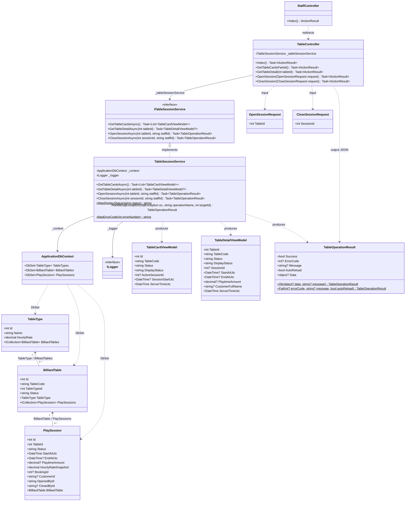
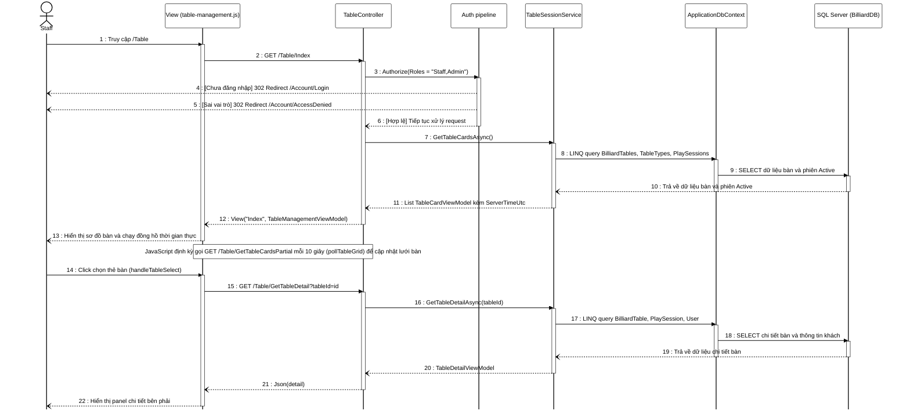
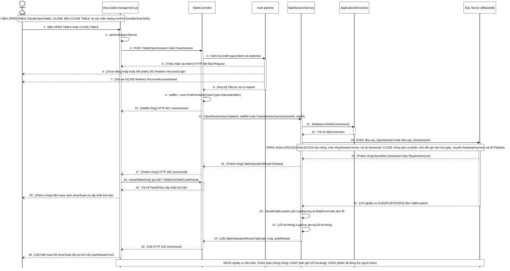

# II. Detailed Code Design

## 1. Quản lý bàn và phiên chơi

### 1.1 Class Diagram

**Hình II.1 — Class Diagram Phân hệ Quản lý Bàn và Phiên chơi.** Các thành viên trong sơ đồ phản ánh chính xác 100% mã nguồn thực tế. Nhằm đảm bảo sơ đồ trực quan và vừa vặn một trang báo cáo, các thuộc tính của Entity và ViewModel được rút gọn tập trung vào các trường khóa và trạng thái phục vụ luồng nghiệp vụ. 

> [!NOTE]
> - **Kiểm soát quan hệ:** Entity `PlaySession` chỉ lưu các scalar foreign key (`BookingId`, `CustomerId`, `OpenedById`, `ClosedById`) mà không khai báo navigation property tới `ApplicationUser` hay `Booking`. Việc đọc họ tên khách hàng (`CustomerFullName`) được `TableSessionService` thực hiện qua phép LINQ JOIN với bảng `_context.Users`.
> - **Cơ chế gọi Stored Procedure:** `TableSessionService` sử dụng kết nối `SqlConnection` lấy từ `_context.Database.GetDbConnection()` để gọi trực tiếp các Stored Procedure `usp_OpenSession` và `usp_CloseSession`, dùng chung connection pool với Entity Framework Core.
> - **Điều hướng:** `StaffController` chỉ chứa action `Index()` thực hiện chuyển hướng (`RedirectToAction`) sang `TableController.Index()`.

| Class | Trách nhiệm |
|---|---|
| `TableController` | Tiếp nhận yêu cầu HTTP từ giao diện nhân viên, kiểm tra quyền và xác thực token CSRF, trích xuất `StaffId` từ `ClaimsPrincipal`, điều phối service và trả về Razor View hoặc JSON. |
| `StaffController` | Điểm vào nghiệp vụ của nhân viên từ layout chung; chuyển hướng sang `TableController.Index()`. |
| `ITableSessionService` | Interface trừu tượng hóa nghiệp vụ bàn và phiên chơi, cho phép phân tách lỏng và phục vụ kiểm thử đơn vị. |
| `TableSessionService` | Triển khai logic nghiệp vụ bàn: đọc danh sách bàn và chi tiết bàn qua EF Core, gọi Stored Procedure qua ADO.NET, dịch mã lỗi SQL sang tiếng Việt và điều phối logging qua `ILogger`. |
| `ApplicationDbContext` | Lớp ngữ cảnh cơ sở dữ liệu Entity Framework Core; cung cấp các `DbSet` (`TableTypes`, `BilliardTables`, `PlaySessions`) và quản lý kết nối CSDL chung. |
| `ILogger` | Thành phần logging framework ghi nhận các cảnh báo nghiệp vụ (`LogWarning`) và nhật ký lỗi hệ thống (`LogError`). |
| `TableType` | Thực thể ánh xạ bảng `TableTypes`, định nghĩa danh mục loại bàn (Pool, Carom) và đơn giá giờ cố định. |
| `BilliardTable` | Thực thể ánh xạ bảng `BilliardTables`, quản lý mã bàn, vị trí tầng, trạng thái vật lý và liên kết phiên chơi. |
| `PlaySession` | Thực thể ánh xạ bảng `PlaySessions`, lưu vết vòng đời phiên chơi từ khi mở đến khi đóng và chốt tiền giờ. |
| `TableCardViewModel` | Mô hình dữ liệu hiển thị thẻ bàn trên sơ đồ POS (mã bàn, trạng thái, giờ bắt đầu phiên và thời gian server UTC). |
| `TableDetailViewModel` | Mô hình dữ liệu hiển thị panel chi tiết bên phải (thông tin bàn, khách hàng, thời gian chơi, giá snapshot và tiền giờ chốt). |
| `OpenSessionRequest` | Mô hình nhận dữ liệu `[FromForm]` khi nhân viên yêu cầu mở bàn (`TableId`). |
| `CloseSessionRequest` | Mô hình nhận dữ liệu `[FromForm]` khi nhân viên yêu cầu đóng phiên (`SessionId`). |
| `TableOperationResult` | Cấu trúc phản hồi JSON đồng nhất cho mọi thao tác POST: cờ thành công, mã lỗi, thông báo hiển thị, dữ liệu kèm theo và cờ tự động tải lại lưới (`AutoReload`). |

---

### 1.2 Sequence Diagram — Xem danh sách bàn và theo dõi thời gian thực

**Actor:** Nhân viên (`Staff`) hoặc Quản trị viên (`Admin`).  
**Route:** `GET /Table`, `GET /Table/GetTableCardsPartial`, `GET /Table/GetTableDetail`.  
**Điều kiện trước:** Người dùng đã đăng nhập với Cookie xác thực hợp lệ và thuộc role `Staff` hoặc `Admin` (`[Authorize(Roles = "Staff,Admin")]`).  
**Kết quả:** Hiển thị sơ đồ bàn POS; đồng hồ đếm giờ tự động cập nhật thời gian thực; panel chi tiết hiển thị đầy đủ thông tin bàn được chọn.

**Mô tả chi tiết các cơ chế phía trình duyệt (`table-management.js`):**
1. **Đồng hồ thời gian thực và Bù lệch giờ (Clock Skew):**
   - Khi tải trang hoặc nhận HTML từ polling, JavaScript đọc thuộc tính `data-server-time` của phần tử `#table-grid` để tính độ lệch thời gian: `deltaOffset = Date.now() - parsedServerTime`.
   - Một hàm đếm nhịp `updateClocks` được kích hoạt mỗi 1 giây (`setInterval(updateClocks, 1000)`). Hàm này duyệt qua tất cả thẻ bàn có thuộc tính `data-session-start`, tính số giây đã trôi qua dựa trên `(Date.now() - deltaOffset) - startParsed`, định dạng thành chuỗi `HH:mm:ss` và cập nhật trực tiếp vào DOM (`.table-clock`).
   - Nếu panel chi tiết bên phải đang hiển thị và bàn đang chọn có phiên Active, trường `Duration` của panel cũng được cập nhật đồng thời mỗi giây.
2. **Page Visibility API:**
   - Script lắng nghe sự kiện `visibilitychange` trên `document`. Khi người dùng chuyển sang tab khác (`document.hidden = true`), quá trình polling định kỳ và cập nhật đồng hồ được tạm hoãn để tiết kiệm tài nguyên. Ngay khi tab được kích hoạt trở lại, script lập tức cập nhật lại đồng hồ và gửi một yêu cầu polling để làm mới lưới bàn.
3. **Quản lý Panel chi tiết bên phải:**
   - Mặc định khi tải trang, panel chi tiết được ẩn bằng class `d-none`.
   - Khi nhân viên click vào một thẻ bàn hoặc nhấn `Enter`/`Space`, panel được hiển thị (`classList.remove('d-none')`), thẻ bàn được gắn viền sáng (`selected`) và gửi yêu cầu `GetTableDetail`.
   - Nhân viên có thể đóng panel bằng nút đóng ✕ (`#btn-close-detail`) hoặc nhấn phím `Escape`. Khi đóng, hàm `closeDetailPanel` dọn dẹp các trường dữ liệu, bỏ viền sáng thẻ bàn và tự động trả con trỏ focus về thẻ bàn vừa thao tác (`lastSelectedCardId.focus()`) nhằm hỗ trợ điều hướng bàn phím hoàn hảo.
   - Nếu qua một chu kỳ polling mà bàn đang chọn không còn tồn tại trên sơ đồ, hàm `resetDetailPanel` sẽ tự động ẩn panel để tránh hiển thị sai lệch.

---

### 1.3 Sequence Diagram — Mở bàn và đóng phiên chơi (Sơ đồ gộp)

**Actor:** Nhân viên (`Staff`) hoặc Quản trị viên (`Admin`).  

**Route:**
- **OPEN:** `POST /Table/OpenSession` (nhận `TableId` và `__RequestVerificationToken`).
- **CLOSE:** `POST /Table/CloseSession` (nhận `SessionId` và `__RequestVerificationToken`).

**Điều kiện trước:**
- **OPEN:** Bàn đang ở trạng thái `Available` (Trống); Cookie phiên làm việc hợp lệ với role `Staff` hoặc `Admin`.
- **CLOSE:** Bàn đang ở trạng thái `InUse` và phiên chơi đang có `Status = 'Active'`; Cookie phiên làm việc hợp lệ với role `Staff` hoặc `Admin`.

**Kết quả:**
- **OPEN:** Bàn chuyển sang `InUse`, tạo bản ghi phiên mới với `Status = 'Active'` trong `PlaySessions`; đồng hồ bắt đầu chạy; hoặc nhận thông báo lỗi tiếng Việt nếu thao tác bị từ chối.
- **CLOSE:** Phiên chơi chuyển sang `Status = 'Closed'`, tiền giờ được chốt; bàn chuyển sang trạng thái `AwaitingPayment` (chờ thanh toán); hiển thị số tiền giờ phải thu trên giao diện.

**Mô tả chi tiết xử lý kỹ thuật:**
- **Xác nhận người dùng và CSRF:** 
  - Với thao tác mở bàn, nhân viên nhấn nút OPEN TABLE trên panel chi tiết (`handleOpenTable`).
  - Với thao tác đóng phiên, JavaScript hiển thị hộp thoại xác nhận `window.confirm("Bạn có chắc chắn muốn đóng phiên cho bàn ...?")` (`handleCloseTable`) nhằm ngăn chặn đóng nhầm.
  - Yêu cầu được gửi qua Fetch API với `Content-Type: application/x-www-form-urlencoded`. Token chống giả mạo được lấy từ phần tử ẩn `@Html.AntiForgeryToken()` bằng hàm `getVerificationToken()` và đóng gói cùng tham số qua `URLSearchParams`. `TableController` áp dụng bộ lọc `[ValidateAntiForgeryToken]`. Nếu thiếu hoặc sai token, ASP.NET Core từ chối ngay với HTTP 400 Bad Request.
- **Bảo mật danh tính và quyền hạn:** Controller áp dụng `[Authorize(Roles = "Staff,Admin")]`. Nếu chưa đăng nhập hoặc cookie hết hạn, hệ thống chuyển hướng về `/Account/Login`. Nếu sai vai trò, chuyển hướng về `/Account/AccessDenied`. Controller tuyệt đối không nhận `StaffId` từ client mà trích xuất từ Claims qua `User.FindFirstValue(ClaimTypes.NameIdentifier)`. Nếu `StaffId` rỗng, controller trả về HTTP 401 Unauthorized.
- **Thực thi Stored Procedure:** `TableSessionService` lấy đối tượng `SqlConnection` từ DbContext qua `Database.GetDbConnection()`, mở kết nối và gán tham số an toàn qua `SqlParameter`:
  - `usp_OpenSession`: Đặt khóa `WITH (UPDLOCK, HOLDLOCK)` trên bản ghi bàn, kiểm tra `Status = 'Available'`, kiểm tra giữ chỗ booking, tạo bản ghi `PlaySessions` mới (`Status = 'Active'`) và trả về `SessionId`.
  - `usp_CloseSession`: Đặt khóa trên bàn và phiên, tính tiền giờ làm tròn theo công thức $\text{ROUND}\left(\frac{\text{DATEDIFF\_BIG(second, StartAtUtc, EndAtUtc)} \times \text{HourlyRateSnapshot}}{3600.0}, 0\right)$, chuyển bàn sang `AwaitingPayment`, đóng phiên (`Status = 'Closed'`) và trả về `PlaytimeAmount`.
- **Xử lý phản hồi và mã lỗi:**
  - Khi thành công: Controller trả HTTP 200 kèm `TableOperationResult.Ok`. JavaScript hiển thị Toast xanh thông báo và tự động gọi `reloadTableGrid()` (`GET /Table/GetTableCardsPartial`) để làm mới lưới bàn.
  - Khi gặp lỗi nghiệp vụ CSDL (mã `51402` bàn không trống, `51407` bàn giữ chỗ booking, hoặc `51502` phiên đã đóng bởi người khác): Service bắt `SqlException`, ghi nhật ký cảnh báo qua `_logger.LogWarning`, dịch mã lỗi sang thông báo tiếng Việt qua `MapErrorCode` và trả về `AutoReload = true`. Giao diện hiển thị Toast đỏ và tự động tải lại lưới bàn để đồng bộ trạng thái mới nhất.
  - Khi gặp lỗi hệ thống không xác định: Service ghi nhật ký lỗi qua `_logger.LogError` và trả về `AutoReload = false`. Giao diện hiển thị Toast đỏ và giữ nguyên trạng thái màn hình.

